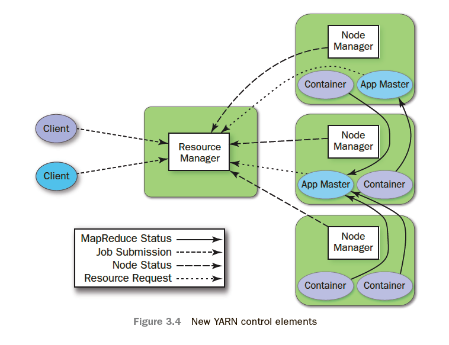

# Лекции в МИФИ
## 04.09.24 Лекция 1
Иерархичность серверов => Главные меняются. Clos архитектура.
Система хостов полносвязанна, имеет локальные диски. Общих данных нет, только обмен сообщениями.
Клиент как именно часть распределенной системы.
- Отказоустойчивость
- Не хватает одного хоста (вычисления/память)

Задача "консенсуса" как самая сложная в распределенных системах.

Задача: (похожа на  nosql )
key-val storage 
set(k, v); get(k) -> v.
Подразумевает асинхронность, но ответ даже на set необходим обязательно.
Лучше не отвечать, пока гарантированно не записал, у себя и желательно в остальных хостах.

Игнорим ошибки памяти(византийские гарантии),cpu, шанс что диск записал не то (check sum).
Host: 
- crash free;
- crash stop - сервер умер и не восстановиться; 
- crash recovery может восстанавливаться и умирать постоянно. или полностью умереть как в crash stop.

Сеть - пакеты:  пусть нет corrupt, но может быть drop, а также duplicate. 

Fair loss  - рано или поздно сообщение будет принято

Perfect link - идеальная модель в которой все доходит 1 раз. 
Но даже в ней с умирающими хостами приколы.

Fairloss + tcp/ip = perfect link в достаточных для практики  пределах
Работаем с perfect link но не смотря на это помним про проблемы 

1.  Отказоустойчивость: не смотря на смерть хостов данные будут сохранены  
2. Масштабируемость (вплоть до линейной)
3. Консистентность

~40  хостов - стойка. Обмен данными к хостам через общий switch.
Тогда важно писать в хосты на разных стойках.
Иерархия доменов отказа.

round trip time 1-3 ms в data center 

Два вида свойств/гарантий в распределенной системе:
1. Safety Система ведет себя или корректно или нет.
2. Liveness . Три режима ответа сети. О времени ответа сети,  том, когда будет полезный ответ. Асинхронная, синхронная, частичная. Частичную рассматриваем. 

Время и часы.
Дрейф часов. Кварцевые ~1.7 sec/day. Атомные. Можно сказать не дрейфуют.
Но синхронизация часов тоже требует время.
Физические часы:
wall clock - аппаратные. Синхронизируются, есть високосные секунды.
monotonic clock - Локально. С момента старта. Никогда не откатываются.
Логические часы.

не можем синхронизировать больше чем eps.

## 07.09.24 Семинар 1
Сем. Ссылки с него 
Некий [userver](https://userver.tech/)
Описание про [thread](https://wiki.osdev.org/Thread)
[Примеры](https://github.com/chriskohlhoff/asio/tree/master/asio/src/examples) асинхронности, синхронности сервера


## 11.09.24 Лекция 2
K-v storage.
Regular Register.
Write (val)
Read->val

Single write. 
3  хоста всего. Можно ли писать на 3 хоста? На 1 нельзя, так как он сам может умереть. На три нельзя, потому что хосты умирают и если будем писать на 3 при смерти хоста запись не будет выполнена. Пусть пишем хотя бы на 2 хоста всегда. 

Надо выбрать все три  и дождаться ответ от двух.

Читать с 1го хоста? Нет, может умереть.  Или может сохранять старое значение. 
Читать с 3-х хостов, нет так как если при такой системе умрет один алгоритм никогда не завершится.
Читаем с 2-х хостов. 

Соответственно пишем/читаем на 2 хоста.  Тогда если читаем, то обязательно пересечемся хотя бы с 1-м из тех хостов на который писали. Кворум. Читаем кворум, пишем кворум. 
Как определить где новые данные? **Timestamp**.Их генерит Single writer. Именно single, что бы можно было просто ++ на счетчик и ничего не синхронизировать. Логическое время.
Что-то типа requestId не работает. Так как они не упорядочены. Упорядочевать id в распределенных системах - задача сложная. 


В целом думают вначале так, что у нас есть лидер, потом решают как от этого избавиться т.е. как выбирать лидера.
| w1  |   |                         w2          |  
   |     r2   |
          |    r1            |
Такое возможно. Так как для  read2 может быть кворум:
 |         /    |  
 |2    /1/    |  
 |    |  | | |  | |   
|        / 1  / |  
     /

Write majority.
N хостов. 
2N -> N+1 пишем .  Fault tollerance  N - 1
2N +1 ->N+1 пишем. Fault tollerance N
Fault tollerance  - максимальное количество отказавших хостов. 

Кворум- любая система множеств в которой любые 2 множества пересекаются. 

Ассиметричный кворум - пишем на 4, читаем с 2-х. Типо чтение - чтение могут не пересечься. Используется когда очень много чтений.

Четное число хостов не уважают и считают что так не делают.
Так как кворум одинаковый, а Ft меньше.

Модели консистентности. 
Самая "слабая":
Eventual consistency  - когда-нибудь все будет отлично и система придет к консистентному состоянию.

Самое "сильное" свойство.
Linearizability
Linearization point.
Операция произошла в какой то **определенный** момент времени. До него операции не было, после точки она есть.

Sequential consistency.
Разложение истории на временную ось без пересечений. 


Atomic register. 
Read Impose 
|read from quorum| impose |
impose = write  on quorum


## 14.09.24 Семинар 2
Процесс - единица исполнения, обладающая ресурсами(памятью)
Поток - -//- не имеет своей памяти 
На стороне OS и управляет OS через sheduller с вытесняющей многозадачностью.
FIber - кооперативная многозадачность. Работает пока сам не остановит себя.
Subroutine - просто функция  в ЯП
Coroutine - функция, что может быть остановлена и потом быть восстановлена с того момента, на котором была остановлена.

Stackfull / Stackless 

Callback генерятся сами внутри co_await 
В stackfull нет этих слов, там будет прям объект coroutine и его pure методы.

Примитивы синхронизации для fiber будут немного отличаться, ведь надо стопить определенный fiber, а не весь thread.

Courutine - при использовании co_wait, сама вставляет callback.

[Фреймворки](https://www.techempower.com/benchmarks/#hw=ph&test=fortune&section=data-r22) с fiber.

Userver
Почитать [документацию](https://userver.tech/)


## 18.09.24 Лекция 3
1 Writer -> multiple writers. 
Было у каждого write некоторый строго увеличивающийся timestamp. Порядок строился на них.
R  = R + W
W = R 
Собрали кворум на R из этого read получили timestamp потом делаем W (timestamp + 1)

Пришло два w по одному timestamp. Надо линеаризовать => упорядочить, но не важно как. Тогда добавим к timestamp у W  какой-то глоабльный уникальный ключ - GUID. И все, посортим по нему, ведь порядок должен быть любой. 

Доказательство линеаризуемости. 
    01
R + w         O2
          R + w
Кворум на O1 W и  O2 R пересекутся, получим из них timestamp. 
timestamp O1<=timestamp O2


Операция CAS. Compare and swap
```
CAS(k, v, v*)
	if (stor[k] == v){
	stor[k]=v*;
}
```

На какждом хосте должен быть один и тот же порядок что бы CAS работал корректно.
(Тогда CAS должен быть блокирующим для машины?)

Replicated State Machine.
	A replicated state machine is **a deterministic state machine where multiple machines have the same state and run the same**.
({stat}, {transition}). Transition - какой-то переход  внутри хоста по автомату.  
Хотим автомат разложить на все реплики в начальном состоянии? 
Хотим что б ы на каждом хосте операции прмиенились в одном порядке, что бы в конце концов все хосты были в одном и том же состояниию.
?????

Atomic Broadcast
A-Broadcast(m) <- отправить всем сообщение 
A-Deliver(m) <- обработчик
Свойства ^7c1e2a
- Validity, если не сбойный узел сделал  A-Broadcast(m) то он позовет A-delivery.
	Узел сбойный тогда, когда он умирает и не взаимодействует больше с другими узлами. Все остальные узлы не сбойные. 
- Agreement , если на не сбойном хосте позвался delivery(m) , то на всех остальных он тоже позавется. 
Получаем гарантию что все сообщения будут получены несбойными хостами. 
- **Total order**, Для двух хостов посмотрим их историю в любой момент времени. Тогда один из них является префиксом другого или наоборот.  

RSM с помощью Atomic Broadcast.
Broadcast оставляем.
Deliver - переключить состояние. 
При запросе: Broadacst, ждем deliver, при получении отправляем ответ клиенту.

Reg < Reg + CAS < RSM < AB < Consensus


Linearizability AB

То есть по total order другого порядка нигде быть не может, а значит и линеаризуемо.

Если узел координатор(к которому в начале пришел клиент) умер до отправки ответа клиенту, а такое может быть. То, это уже должен фиксить клиент. То есть если он не получил ответ, то он должен еще раз сходить в систему и сделать check или retry.// Exactly once нигде нет. 

Mutex = RSM 
Node &harr; Node

RSM умеет переживать перезапуски машин!

Propose(v) -> v\* 
v\* вернется на все хосты, причем $v* \in {v1,v2,v3}$

Validity - safety (на конечном промежутке)
Agreement - safety (на конечном промежутке)
Termination - Liveness ( на бесконечности)

AB:
Validity - liveness
Agreement - liveness
Total order - safety  


AB -> Consensus
Ab(m1), delivery вернет то, что типо должен вернуть propose
Ab(m2)
Ab(m3)

Consensus -> AB
Reliable Broadcast

Если сообщение пришло на хост первый раз то еще раз отсылаем всем и потом отправляем обработчик не дожидаясь ответа. 
AB: 
R-B(m) + R-D(m): Buf += m

Background: постоянно крутится процесс. 
Несколько раундов консенсуса. A = отправленные сообщения 
while buffer - A not empty{ 
propose(всех сообщений из buffer - A), вернет R\*
Ad(r\*)
}
## Семинар 3. Кр 1
## Лекция 4. FLP

~Кривое доказательство что cas не работает без state machine.

Алгоритм  работы AB. Смотри [[Распределенные системы#^fd9023]]

Задача бинарного консенсуса. $v* \in \{0,1\}$

Мы не отличаем partition от отказа узлов. 
При разделении посчитаем, что меньшая часть не будет выполняться. 
Тогда любой алгоритм консенсуса переживает $\frac{N - 1}{2}$ отказов.

[Теорема FLP.](https://neerc.ifmo.ru/wiki/index.php?title=%D0%A2%D0%B5%D0%BE%D1%80%D0%B5%D0%BC%D0%B0_%D0%A4%D0%B8%D1%88%D0%B5%D1%80%D0%B0-%D0%9B%D0%B8%D0%BD%D1%87%D0%B0-%D0%9F%D0%B0%D1%82%D0%B5%D1%80%D1%81%D0%BE%D0%BD%D0%B0_(FLP))
Опр. Для любого алгоритма консенсуса который переживает хотя бы 1 отказ существует такое исполнение что алгоритм не завершится. 

Говорим что никогда не нарушаем Validity и Agreement. Значит можем нарушать Termination.
Доказательство. 

Конфигурация - состояние всех узлов + все сообщения в сети. Типо Snapshot. 
Есть направленные переходы между узлами: Доставили сообщение m.
Получили так граф конфигураций.

Исполнение - путь в графе = порядок доставки сообщений. 

Графом конфигурации описывается любой алгоритм консенсуса. Конкретное исполнение - конкретный путь. 

Бесконечное исполнение - бесконечный путь ИЛИ цикл.

Доказательство итеративное.

Лемма 1. ~Существует начальное состояние нам нужное.  = начальное бивалентное состояние. 
Для бинарного консенсуса. Каждая нода позвала propose.  Получается  $2^{n}$ начальных конфигураций.
Валентность конфигурации - то что вернет консенсус.
Конфигурация унивалентная есть мы знаем с каким значением завершится алгоритм. 
Конфигурация бивалентная если не знаем.

- 0 валентная

$$
R_{0} = \begin{pmatrix}
0 \\
\dots \\
0\end{pmatrix}
$$ 

- 1 валентная

$$
R_{n} = \begin{pmatrix}
1 \\
\dots \\
1\end{pmatrix}
$$ 

$$\Rightarrow \exists k : R_{k} \text{0 валетная, } R_{k + 1} \text{1 валетная,} $$
Они отличаются только значением k+1 хоста. Так как алгоритм переживает падение 1 узла, то этот k+1 узел можно выкинуть. А значит оба этих узла бивалентные. 


Лемма 2. ~Всегда существует переход, который приводит в не завершение. = для любой бивалентной конфигурации можно найти следующую за ней бивалентную.
$$\forall (p,m), \forall c \text{ бивалентное }\exists \text{ путь } c \to c' \text{ что (p,m) , будет доставлен последним в этом пути и  }c' \text{ бивалентное }$$

Причем в этом пути не должно быть более 1 хоста умерло. 
S - множество конфигураций где (p, m) не доставлено
S' доставлено из S (p, m) последним.
А за границей этого контура что-то что после s'.


Лемма 2.1. Хотим доказать что в S' есть бивалентное состояние.
Докажем от противного. Пусть там только унивалентные. 
Рассмотрим случаи где может быть 1 валентная, 0 валентная????
Значит в s' есть и 0 и 1 валентная.

1 в s => если из 1 валентное доставляем сообщение, она остается 1 вал в s'
Если за границей то туда мы могли прийти из s' по .


Лемма 2.2.
Найдется такая конфигурация что в ней решится судьба вернется 0 или 1. Доказательство. 


## Семинар 4. FLP, DFS part1.
Теорема. (повторение  из лекции).
faults < n/2
Не различаем partition и падение узлов.
Слева 3 node (A) справа 2 node (B)
При потере сети Nodes справа буду тупо бесконечно ждать. 
То есть хоть в какой то части должно быть нарушено свойство termination.
faults < b или faults < a <=> faults < max(A,B)
minimize(max(A,B)) -> A~B~n/2. 
n = 2k+1  A = k +1 b = k
n = 2k a = b=k
f < n / 2.

Алгоритм консенсуса не может завершиться даже если $f \geqslant \frac{n}{2}$.

FLP теорема (CAP теорема consistency, availability, partitioning - нельзя построить распределенную систему, в которой выполняются все 3 свойства.)

FLP на практике бесполезна, а теорема о n/2 на практике учитывают.
Так как в FLP говорится, что если случился 1 отказ то сценарий как там теоретически может случиться. И по факту такое бывает редко 

Dead lock и Live lock - программа что-то делает вычисляет, но по факту полезная работа не выполняется.
При нарушении FLP будет livelock, при нарушении n/2 в системе все вообще плохо.

FLP повторение доказательства. 

У каждой node: in memory per host, disk per host, outgoing message. Назовем это конфигурацией.
Строим граф конфигурация. Исходящих ребер максимум количество сообщений в сети. 

 
Рассмотрим исходное для S состояние. Они бивалентно. 
Значит в S есть и 0 и 1 валентные. Дальше если в S' есть 0 состояние или 1 состояние. Дальше см переходы из S. Провести эти рассуждения. 


И в S0 и в S1 могут быть бивалентные состояния. Говорим что S0 - переход в 0 по (h,m), S1 - в 1.
Всегда существует путь из S0->S1. Почему? Стартовое 0/1. Пусть этого пути нет. Пусть стартовое лежит в S0. Как то же оно должно попасть в S1. А вот он и путь. 

Если хосты разные отправляют разные сообщения, то порядок нам не важен. 
Значит h = h' Тогда все решает хост h. 
Крутимся через самое старое сообщение в сети.
Зачем самое строе сообщение из сети берем? Если будем брать не самое старое то некоторые сообщения будут лежать вечно. Из-за этого там могут лежать сообщения разных хостов. А мы переживаем только 1 отказ(только сообщения 1го хоста могут лежать вечно). 

Мы ожидали 1 отказ. А мы построили 0 отказов и при этом имеет live lock. Где 1 отказ применяется?
Отказ нужен не для исполнения, он нужен что бы алгоритм **был бы к нему готов** и алгоритм выполняет какие-то шаги рассчитывая на то, что отказ возможен. 

### Распределенные файловые системы. DFS

GFS - Google file system. Первая версия. Colossus.  

syscall. open, write,read,move,remove.
В обычной FS есть inode, хранящая информацию о файле, здесь тоже будем иметь inode/
DataNodes где мы хранимы данные.
Файлы будем разбивать на части - chunk. Что бы хранить в разных местах. 
Коэффициент реплекации - RF. В скольких нодах храним chunk. Начнем с RF=3
Пишем на 2 ноды, на 3-ю дореплицируем потом репикатором. 
Replicator - дореплицирует недостающие chunk если количество записей меньше RF.
Chunk - Node ids, RF, 
Inode - Chunk ids, path, creation date, id. 

PrimaryMaster - RSM

Master-Slave replication
Chunk immutable в современных системах. И не фисированного размера. 
Хотим append в файл. PM находит nodes 

Merger.  Условно слишком маленькие chunk будет объединят в нормального размера.


## Лекция 5. DFS part2. 
Продолжение семинара.
Есть много data nodes для хранения файлов.
Есть сущность file, состоящий из chunk ids, ID, Path.
Есть сущность Chunk, состоящая из RF, data Node ids, ID.
Хотим в файл уметь append, read,move,open,remove.
Есть  еще pm(rsm внутри) который мониторит все пути и структуру.
```
Open = pm : ReplicatedOpen(request)
	if file  does not exist
		create file
	return descriptor
```

Append
1. client->Pm.open(),
В Pm не пишем данные, будет слишком нагружаться.
1) build chunks
2) store chunks
3) update chunk ids(in file)
Разделение на chunks можно встроить в клиентскую библиотеку. Не лучший выбор, так как при желании обновления chunk придется обновлять всех client, но можно начать с этого.
Лучший способ - использовать некоторый proxy, где будет наш код который мы всегда сможем обновить. Ходить к Pm / data nodes будем через proxy. (Пока не рассматриваем.)

Заведем SecondaryMaster(SM тоже RSM внутри) которые будут отвечать за chunks и data nodes.(Какой chunk лежит на каких nodes) (PM знает про дерево файловой системы).

2. client -> Sm  creat chunk
3.  client->data nodes store chunks
4. client->pm update chunk ids

Есть две стратегии информации о chunks в SM. Вторая  : data nodes хранят инфу про то,какие они chunks хранят и периодически отсылают  эту инфу в SM. 

Итак, в SM храним struct chunk,в котором RF, chunk id, node ids.
```
Replicated Append(request)
	File chunkids.append(request.chunkids)
```
Нужно еще учесть:
После restart проверять валидность данных.


Datanodes <->SM посылают раз в n секунд heartbeat.
SM:
Transient state(in memory) : chunk, node -> last alive time
Persistent state(RSM): chunk->node ids, rf
Heartbeat обновлять будет Transient state.

Current rf можно вычислить по списку node в transient state.

Шардирование. Данные, разбитые на маленькие блоки назовем shards. Нужно что бы не искать в 1 м большом чем то, а разбить на несколько и искать в нескольких.
В целом, SM может быть шардированным. (PM не может быть. Не понятно как шардировать дерево).

Шардирование и heartbeat - то почему нужны SM. PM  бы не вывез.

Replicator. Как делать репликацию. Делать надо в SM. 
1. Under replicated chunks
2. Pick chunks for replicator
3. Pick alive node <- source target node
4. Send replicate request to source node 

Может ли быть 2 replicate? Если юзать чисто transient и узлы падают, то да.
Overreplicated chunk тоже бывает, от них стоит избавляться тоже.

Диапазон между retry.
Jitter(случайная величина) и backoff(постоянная) определяют это время ожидания.

Консистентность append. 
Вариант 1 При открытии брать lock .На момент записи проверять есть ли lock.
Вариант 2 Механика prerequisite timestamp. Каждое действие PM будет снабжаться  timestamp. 
В File будем хранить Modification  timestamp 

Read return file mts (FMTS)
при append будем слать (FMTS). Если такой же, то файл не меняли в промежутке. А если нет, то кто то менял и чанки не валидны и надо заново делать append. "оптимистичная блокировка"

Делать retry read, так как обычно  write меньше и вклиниваний будет  мало. 

Move происходит строго в памяти PM. Так и все операции над директорией происходят чисто в PM.


## Семинар 5. что то по userver

gRPC
Protobuf

## Лекция 6. Map reduce v1.
Повторение DataNode,primary master. 

Map Reduce. 

Данные хранятся в виде таблицы 
table = list of rows. Row = map\[name_col\] -> value.
table = list (key,value). 
Просто 2 способа говорить об одном и том же 

Операция map(row) -> row\*
map(key, value)->\[key\',value\' \]

Операция reduce(key,\[value\]) -> \[value\]

Пример. Посчитать количество слов в таблице. 
Утверждение. Практически все вычисления можно делать в терминах map/reduce.

ps -efl | awk '{print $3}' | sort | uniq -C
		map                       reduce

Inner join. Декартово произведение пересечения двух множеств. Брем 2 входа и объединяем по ключу. 

Реализуем Hadoop v1.
Параллелим map. Разбиваем просто input на части. Передают машины все в shuffle + sort облако.
1. Приходит клиент с job = \[tasks\], input, output, mapper, reducer, num of map nodes(M), num of reduce nodes(R). Task = map/reduce. Приходит он в некоторый jobTracker.
2. jobTracker идет к PM за дескриптором в DFS
3. Дробит input на M частей и отправляет на map nodes. Сама выбирает какие то nodes  куда отправлять. Сама поддерживает связь через ping с этими map nodes.
4. Map. Накапливает результат в R штук buffer, которые лежат в памяти map node. Partition - buffer для конкретного reducer. Как понять в каком partiotion?  hash(key) % R. Если buffer большой кидаем на диск. Но перед этим вызываем на нем sort.(external algorithms)
5. Хотим на каждую partition теперь 1 файл. Сделаем merge по partition merge sort. Получаем ровно R файлов в ЛОКАЛЬНОЙ системе map node которые внутри отсортированы.  
6.  Shuffle
7. Sort
8. Map после завершения говорит jobtracker результат операции map, когда тот завершился. 
9. Так, Reduce node вычитывает partition из той map node, которая это считала. Reduce node получает это знание из того что ему jobtracker послал. Jobtracker знает, так как map по завершении ping об этом.
10. Результат reducer записывет в DFS. (будет R файлов) 

+:
map, reduce распараллелены. 
Используют HDFS. input имеет некий RF. Так как файл уже лежит на многих машинах попробуем запустить map на тех машинах, где файл уже лежит. Таким образом оптимизируем сеть. 
Locality (оптимайз сети)
Combine (оптимайз сети) 

Fault tolerance. Если падает map или reduce переделываем только task.  Но стоит делать limit. А то так можно получить бесконечный цикл, поскольку пользователь может дать некорректный код. 

Фикс падения job tracker - иногда скидываем в  локальную память(а можно и в DFS) state of tasks. 

Speculatie execution. (+time - cpu) Посылаем на несколько node одну и ту же задачу. Выгодно, так как некоторые nodes быстрее некоторые медленнее.  

Записи в локальную FS : 1 сброс buffer + merge + reducer merge. При записи на DFS можно сделать лишь 1 запись. Объединение файлов через указатели.

R < M. 
DFS А также HDD лучше писать большие куски. Поэтому R лучше не делать маленьким. 
Ограничений на M особо нет. 

Hadoop v3 YARN
Решили для 1- го клиента = 1 job. Как решить для нескольких клиентов = несколько job?
Введем AppManager, который следит за jobs. 1 job = 1 appmanager. Идет к resource manager и спрашивает какие узлы доступны. Resource manager следит за тем, какие node работают.  


#### Дополнения 

https://www.cs.uic.edu/~ajayk/c566/HadoopMap-Reduce.pdf
Hadoop  = HDFS + Map-Reduce framework
Данные и вычисления происходят на одних и тех же машинах. Удобно перемещать код к данным.
Архитектура: Клиент, Master node, Slave nodes.
Клиент приходит в систему с Job, mapper, input, data 
Master node: назначает tasks to map-reduce layer, передает данные в HDFS.
Master Node = Name Node (HDFS) (Он  же Primary Master в любой DFS) + Job Tracker (Map - reduce)
Slave Node = Data Node + Task Tracker.
Связь  от Master Node ко многим Slave Node.

Name Node на Master Node (Primary Master + SM) занимается записью данных в DFS: дробит на чанки, хранит chunkids->data node ids, держит Replication factor и тому подобное.
Job Tracker отправляет таски на slave nodes в которых лежит файл.
Data Node хранит чанки файлов
Task Tracker выполняет саму таску map/reduce. 

Отказы. 
Data Node шлет heartbeats к Name Node (или SM в нашей реализации DFS). Если Data Node падает, ее убираем и данные перераспределяем на другие Data Nodes. 
Task Tracker шлет heartbeats к Job Tracker. При неудаче выбирает другую ноду и отдает таску туда. 

Падает Name Node. В нашем DFS - PM + SM - RSM, там таки проблем нет, а в Hadoop - Backup Node придумали. Backup Node периодически делает snapshots NN посылает heartbetats и если что становится NN. По сути тот же RSM.

Падает Job Tracker. Еще один Single point of failure. In the latest Hadoop architecture Job Tracker is split into application logic such that there can be a number of masters having different logiс. ??? 

Минусы:
Name node и Job Tracker - single point of failure.
Плюсы:
Map и Reduce выполняют параллельно.
Отказоустойивость Slave nodes.


#### Исходная статья про Map Reduce 
https://static.googleusercontent.com/media/research.google.com/ru//archive/mapreduce-osdi04.pdf
Map принимает на вход любые (key, value), к примеру (document name, document contains).
делает новые пары (key2, value2).
По произведенным парам (key2, value2) делаем shuffle + sort, так, что все значения по конкретному ключу приходят к конкретному reducer. reduce(key2, list(value2)) ->list(val3)

Map в процессе обработки входных данных держит некоторое количество (key2, value2) в памяти, затем пишет на локальный диск, разбивая на R частей. Когда Reducer получает от мастера информацию про эти файлы, он читает файлы, сортирует, группирует и подает на вход reduce коду. В итоге пораждается R output файлов.

В исходной статье, если Master умирает то ничего с этим не делается. Ну просто новый потом перезапустится. 


## Семинар 6. Отменено
## Лекция 7 Map reduce продолжение. Скипнуто

#### Дополнения по ссылкам

YARN. Умеем теперь в Hadoop, поверх HDFS запускать любые таски, не только map reduce.

Идея YARN - разделить обязанности Job Tracker - Resource Management и Job scheduling в глобальный Resource Manager и по Application Master на Job . 
Итак, имеем:
Глобальный Resource Manager. Занимается только распределением ресурсов.
На каждой ноде Node Manager. Следит за ресурсами ноды, запускает/убивает контейнер с таской, ходит в Resource Manager с хартбитами, докладывая о статусе ноды.
Application Master теперь ответственен за выполнение джобы. Делает работу JobTracker, только ресурсы запрашивает через Resource Manager.


У ResourceManager есть scheduler, который отвечает за распределение ресурсов. no ApplicationMaster is a privileged service.

AM. Fault tolerance job теперь его работа. Преимущественно user код.  

Scheduler. 
1. FIFO. Использовался в hadoop v1. first come, first served. Job tracker просто берут самый старые job в начале и исполняют их.
2. Capacity sheduler. Конфигурируется очередь, которой выделяется часть слотов/cpu. Это минимальная граница ресурсов доступная там. Есть строгие политики какой юзер какую очередь можт использовать. 
3. Fair scheduler. Каждая Job принадлежит некоторой queue. YARN контейнеры даются очереди, у которой меньше всего выделенных ресурсов. В очереди контейнер дается туда, где у AM меньше всего выделенных ресурсов. Возможны оптимизации: weight on queues(тяжелые очереди получают больше ресурсов), min shares, max shares, FIFO. Но исходная идея - делить ресурсы как можно более равномерно. 
Доли и ресурсы очередей постоянно пересчитываются по heartbeat'ам.

Можно поддерживать что бы у конкретной очереди всегда было каккое то количество ресурсов. = min share. Так же лимитировать можно верхнюю границу = max share

Можно некоторые маленькие таски придержать если надо выполнить большую. Reserved container будет ждать пока остальные локальные контейнеры не выполняться и не отдадут ресурсы. 

Иерархические очереди. Очередь внутри очереди. 


Контейнер - набор физических ресурсов - RAM, CPU, Disk. 
[Dominant Resource Fairness](https://en.wikipedia.org/wiki/Dominant_resource_fairness). CPU, Ram. Целью DRF является нахождение максимального значения x, при котором все агенты могут получить не менее x своего доминирующего ресурса. 
Запрос юзера \[1 cpu, 4gb ram] utility (x) = 2.
System: 9 CPU, 18 RAM
A : \[$\frac{1}{9} CPU, \frac{2}{9} RAM$\]
B:  \[$\frac{1}{3} CPU,  \frac{1}{18} RAM$\]
max x = $\frac{2}{3}$: а получит 3 таски, b получит 2 таски


## Семинар 7. RAFT 
 Оригинальная [статья](https://raw.githubusercontent.com/ongardie/dissertation/refs/heads/master/online.pdf)
3.1
Разделили на подзадачи все, что можно было: выбор лидера, репликация лога, safety.
Упростили состояние state. 
3.2
Производится выбор лидера, он отвечает за репликацию прием команд от клиента и дальнейшую репликацию лога на followers.
Важные свойства, которые гарантируются всегда:
1. Election safety. В каждом **терме** может быть максимум 1 лидер.
2. Leader append only. Лог лидера никогда не удаляется, только добавляется.
3. Log matching. Если в двух логах есть элемент  с одинаковым индексом и термом, то логи до этой сущности одинаковые. 
4. Leader Completeness. Если элемент в логе закоммичен в терме, то он будет в логах лидеров последующих эпох.
5. State machine safety. Если сервер применил команду к state machine, то никакой другой сервер не применит другой команды поэтому же индексу.

3.3 
Сервер всегда в одном из трех состояний: лидер, фолловер, кандидат.
Время разделено на термы. Каждый терм начинается с выбора лидера, в рамках которого или 1 лидер действует или будут происходить перевыборы.
Каждый сервер помнит текущий терм для него. Этот терм меняется при обмене сообщений между серверами. Если кандидат или лидер понимают что у них устаревший терм, они становятся фолловерами. Если они получают меньший терм, такие сообщения они игнорируют. 
Обмениваются сервера сообщениями - remote procedure calls = RPCs. 
Два их типа:
RequestVote - отправляемые кандидатами в период выборов.
AppendEntries - отправляемые лидерами для heartbeats и добавления сообщений в лог.
RPC могут теряться, за их ретраями следить должен requester. 
3.4. Выбор лидера.
У каждого follower есть election timeout, по истечении которого он начинает выборы. Лидер обновляет этот timeout через heartbeats = AppendEntries без log сущностей.
По истечению election timeout, фолловер увеличивает свой терм и становится кандидатом.
Он **голосует за себя** и отсылает RequestVote всем серверам. Дальше 3 варианта:
1. Он становится лидером 
2. Другой сервер становится лидером в этом терме 
3. Никого не выбирают, проходит election timeout, начинаются новые выборы.
Сервер побеждает, если за него голосует кворум.

Если во время ожидания голосов кандидат получает RPC с термом НЕ МЕНЬШИМ своего, он считает тот сервер - лидером. 

Election timeout рандомизированы, так что разделение голосов на выборах минимально. 

3.5. Log replication.
Лидер добавляет команду клиента в лог, посылает серверам AppendEntries, ретраит если надо. После того, как команда была закомичена, лидер ее применяет к своему автомату.
Гарантируется, что Закомиченные сущности хранятся надежно, не будут перезаписаны и будут eventually исполнены всеми серверами. 

Log matching property разворачивается в :
1. Если два элемента в разных логах  имеют одинаковый индекс и терм, то они содержат и одинаковую команду.
Это так, потому что лидер создает как максимум 1 команду с таким log index и таким term, а так же из того, что позиции элементов не меняются.
2. Если два элемента в разных логах имеют одинаковый терм и индекс, то все префиксы логов совпадают.
Это так, потому что так работает consistency проверка в AppendEntries и просто по тому, что так работает алгоритм. Мы перезаписываем все элементы, которые не совпадают с логом лидера. ?


Лидер поддерживает для каждого сервера nextIndex - индекс, начиная с которого, логи совпадают. Когда сервер становится лидером, он определяет эти nexttIndex, хоть бинпоиском пусть перебирает.
3.6 Safety. 
Фолловер может быть недоступен, когда сервер коммитил записи. А потом фолловер становится лидером и команды могут перезаписаться и будут разные команды, надо чинить. 

Это чинится выбором лидера. Для любого терма, ЛИДЕР СОДЕРЖИТ ВСЕ  когда либо ЗАКОММИЧЕНЫЕ записи.


В рафте выборы предотвращают выбор сервера у которого нет закоммиченных элементов. Если лог кандидата актуальный, то сервер голосует за него.
Актуальность = самый старший терм побеждает, а при их равенстве, самый длинный.
RequestVote как раз и содержит инфу про лог кандидата.
Figure 3.7. ЗАПИСЬ НА КВОРУМ НЕ ГАРАНТИРУЕТ закоммиченость записи. 

Что бы этого избежать, закомиченной считается элемент текущего терма, реплицированный на кворум или любой элемент до такового (Log matching property). 

3.6.3 Доказательство Leader Completeness - если когда то лидер закоммитил элемент, то и во всех остальных логах лидеров он будет закоммичен. 
Доказательство От противного.

 Лидер в термеT закоммитил элемент лога, которого нет у лидера последующего терма. Пусть наименьший номер такого терма -  U.
1. Этот  закомиченный элемент лога отсутствовал в логе сервера - лидера терма U на момент его избрания лидером. (Так как лидер никогда не удаляет и не  перезаписывает элементы в своем логе).
2. leaderT

Границы термов и само знание о термах у всех реплик разное.
Применяем только закоммиченные записи в логе. 


## Лекция 8. LSM. Локальное устройство DB.
Кр: задизайнить что-то плана отказоустойчивого сократителя ссылок. (книжный пример, будет что то иное). 

Odered K-v storage persistent local. Отказоустойчивость на 1-й машине.
- put(key, val)
- del(key)
- get(key)
- scan(low, high) -> iterator (Получить все ключи в этом интервале)
Хотим параллельность всех операций.
- Операция Snapshot() -> k, v storage read only. Get и Scan переходят сюда.
Persistent = переживаем перезапуск, хранить будем на диске.
В памяти можно сделать std::map / другие деревья.
В map мы обходим дерево, если память, то это доступ в памяти и это ок. А вот когда мы захотим перенести в диск, то придется постоянно читать с диска, что как известно не здорово. Тогда одно обращение ~2-10мс для HDD. 
Выгодно писать последовательно много. 

SSD.  Набор блоков, блоки разбиты на страницы. Построен на флэш памяти. FTL.
read(page)
program(page) - set 1's to 0's. Только применимо  к чистой (состоящей только из 1)  странице.
erase(block) - set all block to 1. 

Пользователь записал какую-то страницу. Хотим ее изменить -копируем страницу в новое место и меняем на ходу. Страницы ~4Kb. В фоне garbagecollect которые отслеживает состояние блоков и если надо делает erase. 
SSD выгодно что бы писали что-то новое, что бы не перезаписывать данные. Выгодно что бы писали последовательно - пишем целый блок. 

Для того, что бы map работало в памяти, хотим писать последовательно много и что-бы записи были новые. 


B - дерево. В node храним пачку значений K -v. и  B nod на уровне. Выгодно, потому что высота сильно меньше. То есть когда будем обходить дерево, меньше чтений получим. 
B+ дерево. Храним только ключи в node. Значения в листьях. Все node соединяем в список. 

Быстрый Get.
Разобьем сортированный файл на блоки и у некоторого index будет key, offset. Табличку index хранится и на диске и в памяти.  Бинпоиск по ключам (в памяти). нашли offset, вычтем начиная с offset данные. И уже там найдем ключ.  Оптимизация чтения с диска с log раз до 1 го. В index key, offset. Так как мы знаем offset то unzip этой части. 

Быстрый Put (k, v).
Храним некий Log - очередь. 
в Log просто кладем всю операцию (put(k,v)).

Тогда get будет искать первую запись с конца. Будем хранить в памяти MemTable, который будет запоминать последний put в этот ключ. Тогда get ходит только в memtable, put пишет и в log и в memtable.
Когда memtable большой скинем его в файл на диск, как мы делали в get. memtable -> dump -> sstable. sstable - тот сортированный файл и таблица с индексами. sstable будет несколько. К тому же можем еще и zip делать. Чтение будет всего одного диска, по этому 1 unzip ничего. Теперь можем и log удалить, так как все это в sstable. Файлы sstable связаны между собой. 

Static to dynamic. Файлы размера степени двойки, делаем merge когда у 2-х файлов совпадает размер. Compaction.

Delete (k) = put(k, flag). 

Получаем 1 запись = 1 чтение с памятью.  

LSM log-structures merge-tree.

Фильтр Блума. Храним в памяти. 
set[]
- contains(k) -> No\Maybe 
- put(k)
Будем иметь несколько хэш-функций {h}. 
Put(k):
h1(k), hn(k) - позиции в массиве. На эти позиции ставим 1. 
Contains:
h1(k),hn(k) - Если попали в хотя бы в один 0, то точно знаем что нет элемента.
tradeoff error vs size

Тогда sstable = sorted file + index + filter и на диске. index + filter и в памяти тоже. 
При поиске ключа в sstable вначале проверим в sstable.  


Как устроен Memtable. 
Skiplist. Отсортированный list с некоторыми еще указателями вперед.
С какой то вероятностью продолжим добавление на уровень вверх. 
На put и get будет o(log ) как в treap. 

Реализация LSM - levelDB google, rocksDB. 

Всегда новая запись будет в такой реализации.  Только append. Значит можно это делать и в DFS.  

Snapshot нужен для get и scan. Он использует  memtable. Можем просто делать персистентый skiplist. Или же на каждый put делать  fork, так как там COW. 


## Семинар 8. КР 2.
## Лекция 9.  KV DB, шардирование, шард = RSM

### Raft. Доказательство последней теоремы. 
Committed entry:
1. Записано на кворум в этом терме
2. Или есть закомиченная после.
2 является следствием logmatching Property и 1.
Доказательство, что такие записи действительно закоммиченные. 
~Если запись закоммичена, то она будет в логе любого лидера в дальнейшем. 
От обратного.
База. Нет предыдущих лидеров.
Индукция.  Выберем первую ноду, в которой нет интересующей нас записи. 

Рассмотрим первый лидер в логе которого нет записи.
Как мы его избрали? Рассмотрим предыдущий терм. Там должна быть та запись, которой нет в лидере, по предположению индукции(для всех предыдущих лидеров есть запись) она там есть. А удалиться она не могла, так как лидер не удаляет свой лог никогда.

Где применили то, что кворум в текущем терме?
1. last log term = x. По log matching poperty ничего другого записать не можем.
2. last log term  > x 
Индуктивное предположение применимо только после сбора кворума.

### Apply в RSM
RSM = State machine + Log + persistent state.
State machine всегда можно восстановить из лога.
Response to client идет из state machine.

Когда из Log делать apply в state machine?
 Если last commited entry = 10 в текущем терме была закоммичена, то можно применять в RSM записи от предыдущей до 10. Last commited entry храним на диске.  
 persistent state = LCE, 

### KV Database
YT dynamic table/YDB. Spanner/HBase/BigTable.

Static table на многих хостах.
Множество чанков в цепочке. write/read. Записали что то большое, позвали map reduce.

Dynamic tables.
latency~10-100ms
Throughput ~ $10^7$ rps.
Key count >= $10^9$
size $\geqslant 10^{13}$ byte.

Сущность. Tablet. Таблица разбита на Tablets, которые отвечают за диапазон ключей.
Одна из колонок key по которой все отсортировано. 
Шардирование - деление всего: памяти, compute, сеть, состояния. Позволяет одновременно писать в x раз быстрее. 
Chunks - деление только памяти и досупа к таблице.
Размер tablet минимизируют так, что бы overhead был минимальным. ~100MB.

Всегда количество таблетов следует немного увеличить, позволяет распределять нагрузку лучше. Так же позволяет не ждать очень много, если tablet падает. 
На хосте может быть несколько tablet. 
Tablet = RSM.
Primary Master. Храним инфу о таблетах о хостах. Так же структуру что бы делать запросы по шардам. 
PM отсылает heartbeat нодам. Хосты тогда меняем когда некоторые падают.
Производит балансировку нагрузки и решает задачу планирования. Планировщик в отдельном треде. В многопотоке определяем что делать, потом отслыаем в single thread.

Put/get идут в pm узнают tablet опять идут в pm и получают данные. Как исправить?
Кэширем инфу с PM. Меняется инфа только когда хосты умирают. Это не так часто. Так что меняться надо будет только через много $10^7$ запросов.


Гарантии консистентности. RSM дает линеаризуемость. Линеаризуема в терминах 1-й простой операции. Put 10 ключей линеаризуемым и даже атомарным не будет. Проблема из-за доступа к шардам разным. 

RSM base = term, log, last entry , ..., last commited
State machine k = a, v = x; k  = b, v = y;
Деление этой таблицы в памяти - LSM.
Когда запись в LSM когда в state machine. 

Таблет - консенсус группа 3(n) хостов.

## Семинар 9. Транзакции
### Транзакции

2 Клиенты хотят оба write(x), write(y) 
Может быть как угодно, а хотим что бы или write1(x) и write1(y) прошло полностью или только у 2 клиента. То есть транзакции возникают, когда несколько ключей берем. Не проблема когда в 1м шарде(RSM), а если в разных, то проблема, порядок в шардах разный. 
Mutex - та же самая транзакция. У транзакции такая же семантика. lock(), code, unlock().

Транзакции тогда когда клиент обращается к нескольким ключам и это обращение было упорядоченным, с нормальными гарантиями (консистентным).

API Transactions .
startT
abortT
commitT

Теперь клиент не ходит в KV, а в scheduler со startT, потом Read, write. Scheduler ходит в KV.
abortT если KV вернуло к примеру не то, что ожидали. 
commitT фиксирует все в транзакции.

Гарантии транзакций - ACID 
Atomicity,Consistency, isolation, durability.

I - Две транзакции клиентов независимы
D - если случился коммит, то все операции транзакции применились и уже никогда не отменятся.
A - Все операции транзакции или применятся целиком 1 раз или не применятся вообще. 
C - Транзакция оставляет KV в консистентном состоянии. (После транзакции сохраняются инварианты пользователя.) По идее, AID уже дает consistency. 
### Scheduler устройство 

Вспомним, что KV линеаризуемо. 

Scheduler -> \{schedule } (упорядочивает операции)

Расписание - какая-то последовательность операций в KV.
Серийное расписание - все операции 1й транзакции не перемешаны.
Реализация - просто mutex. Берем клиента, остальных блокируем.

View equivalency - два расписание эквивалентны если на каждый read(когда ключи одинаковые, когда разные, то вообще без разницы) они вернули то же самое, но после всех операций оставили KV в одном и том же значении.

Расписание S View serializeable - когда существует такое серийное расписание S\*,  что S \~(view equivalent) S* .

Фича в том, что клиент думает что порядок операций строго T_x, T_y, T_z, в то время как фактически они перемешаны. 

Примеры таких расписаний 

Можем ли мы сделать алгоритм, который порождает view serializable расписание. 
Получим другой класс, более строгий, который можем описать строго.

Strict serializable = view-serializable + realtime order. Если транзакции  упорядочены во времени, то они упорядочены и в серийном расписании. 

Конфликт KV - две операции если, они принадлежат разным транзакциям,  они обращаются к одному ключу, и хотя бы одна из них на write.

Два расписания конфликтно эквивалентны (conflict equivalent) тогда когда они одинаковы в точности до перестановки  неконфликтных операций.

Конфликтная сериализуемость (conflict serializeable) - расписание S когда существует  серийное расписание S* которое ему конфликтно эквивалентно.

Конфликтно сериализуемое расписание удобно представлять в виде графа конфликтов.
Вершины - транзакции. 
Ребра = Дуга(ориентированное ребро): $$ {(T_i, T_j) }, \exists O_x, O_y \&  O_x \text{ конфликтует с } O_y \& O_x \in T_i \& O_y \in  T_j \& time O_x < time O_y $$ 

Ключевая  теорема - расписание конфликтно сериализуемо тогда и только тогда, когда в графе конфликтов НЕТ циклов. 

s - conflict serializable <=> GC(s) acyclic
Доказательство:
=> 
GC(S) = GC(S\*)  так как конфликты только между разными транзакциями.
S* - серийное расписание, а там  Все ребра строго слева на право.

<=
Находим в графе тут вершину, в которую не входит ни одно ребро и ставим все ее операции на первое место, убираем ее и повторяем так далее. Получаем серийное расписание, где все транзакции сгруппированы. = topsort.

### 2PL (2 phase locking алгоритм )

startT -> Transaction id (TID)
Храним LockTable key->TID, timestamp. таблица mutex 
read/write -> sheduler смотрит в LockTable, если там пусто, то записываем туда TID, если нет, то клиент лочится.
commitT - все lock отпускаются 
abortT - все lock отпускаются 

Когда применять операции клиента? 
Ждем commit. Операции делаем в log. Применяем в KV на commit. commit тоже пихаем в log.
Если sheduler умирает? Так что делаем тот же RSM с Log.

Что если 2 клиента обращаются:
c1 w(x), w(y)
c2 w(y), w(x).
Deadlock. Как решать? 
В памяти mutex были на адресе, там можно сделать что то типа максимальный адрес всегда побеждает. Здесь адреса нет. Будем понимать какая транзакция новее по timestamp.
И тогда сделаем правило при deadlock, что побеждает самая старая транзакция. 

Dead lock - когда цикл в графе конфлитов, тогда abort на том, кто новее. Почему на новом? Гарантируем, что транзакция когда-то выполнится, по этому если бы делали abort не на самой старой этой гарантии быть бы не могло. (ее могли бы постоянно отменять, а так самая старая будет выполняться.)


## Лекция 10. Транзакции продолжение 

### Повторение Transactions. 2PL.
Api:
start Tx
R/w-> KV storage
commit Tx / abort Tx
Isolation: Для клиента хотим что бы транзакция проходила полностью. T1 T2.
Client->sheduler->K/v Storage.

### 2Phase-locking алгоритм

LockTable - mutex на каждый ключ 
startTx ->TID
O1(k1), O2(k2) , $\dots$ - берем Lock на ключи. LockTable\[k1] = TID.
потом на commit сбрасываем все Lock. time(Lock) < time(Unlock)
Покажем, что расписание полученное таким образом - Serializable. 
Предположим противное и расписания НЕ конфликтно сериализуемы. Значит есть цикл в графе конфликтов.  
Пример цикла T1->T2->$\dots$->Tk->T1
Lock(T1)\<**Unlock(T1)** < Lock(T2)\<...\<**lock(T1)** = противоречие, так как всегда time(lock) \<time(unlock)

### Deadlock фикс
Wound wait.
startTx -> TID, Timestamp
Если поймаем lock, будем смотреть кто старше. Старшая всегда побеждает. 
Если старшая приходит сначала, то abort на младшую. 
Если младшая приходит сначала, то она просто ждет.

Операции пишем в Log. Commit тоже. Операции делаем, когда пришел commit.

Abort. Просто отменяем.

### Проблемы с performance.
Tx на read-only.
Tx на запись 1го ключа. 
RW mutex. 
На запись mutex будет уникальным. На чтение нет. 

### Snapshot isolation.
startTx ->timestamp
commitTx -> commitTs.
Отсоединяемся в новый Snapshot и делаем изменения там. 
Если Tx1 intersects Tx2 by write Operation и commit Tx1 < Tx2 то abort Tx2.
Not serializeable.
Пример такой аномалии:
T1:
```
if(read(x) == 0)
	write(y,1)
```
T2:
```
if(read(y) == 0)
	write(x,1)
```

В Postgres есть Serializeble IS. Аномалии можно найти в графе конфликтов и исключить.

### Isolation levels DB.
Проблемы 
1. Dirty reads. 
2. Non-repeatable Reads
3. Phantom reads
Isolation Levels:
1. Serializable
2. Repeatable read
3. Read  committed
4. Read uncommited

### Возвращение к Snapshot isolation
Read(key, ts)
Write(key, val, ts) <- write(key val)
write = write с commit TS
read = read с start TS 

Поддержим легко через LSM. Ключ будет составной key + ts.
read = lowerbound 
write = insert(keyts)

DB->Tx->KV storage

### sharded KV storage 
Взяли KV, отсортированное и отшардировали.

Делаем транзакцию внутри 1го шарда.
Меняем Scheduler на Tx manager.
Tx manager на каждый шард.        -> RSM 
LockTable в RAM                                   -> на **лидере** RAFT. Если лидер умер, Transaction abort.
Log на диске                                            ->   RAFT 


Abort:
1. Client
2. Deadlock = wound_wait
3. Leader change = shard update
4. Client die 


Итого, при транзакции в 1м шарде ничего не ломается.

Когда касаемся неcкольких шардов.
Что если 1 шард abort? Надо и на 2м прокинуть abort. Так как надо поддерживать Atomicity.
Это фиксит алгорит 2PC
### 2 PC. 2-commit
1. Фаза Prepare(TID). Чекаем состояние шарда. Если он ответил ок, то мы ждем, что когда нибудь он обязан будет ее применить. 
2. Фаза Commit.


## Семинар 10. Шардирование, шард = лидер,DFS. 
Шардирование Key-value DB 
PM - консенсус. N хостов внутри.
key -> value. Value может быть множеством колонок, не важно.

Разделено по таблетам = на какие то части, в отсортированном варианте. 
Каждый tablet будет жить на какой то RSM, на N нодах.
PM выбирает ноды для RSM.

Когда node умирает, PM переконфигурирует систему и добавляет другую ноду. 
PM оптимизирует как что делить и балансирует нагрузку.
См. Прошлую лекцию.
### Оптимизация Raft. 
Так как raft состоит из 
1. Leader election 
2. Replication 
То, можно ли оставить на двух остальных чисто диски, а лидера в этой группе оставить, выполняющим инфу. Почему так нельзя? Leader election должен происходить в любом случае, но попробуем его назначать по другому. PM может сказать кто лидер из этих хостов. 
Итого, 1. в raft нам не нужна, leader election будет делать PM.

Было 3 хоста, 1 лидер. на каждом RSM. Compute + storage. 

Теперь 1 лидер у которого compute и независимые 3 хоста, которые являются storage = DFS.

Теперь 2 слоя. 
Compute cloud и DFS. PM берет 1 leader в compute cloud и пишет в DFS. 

UPD
Да, действительно. Два слоя. Первый Compute для выбора ноды лидера. Лидера определит PM.
Вторая - хранение данных таблета. У Лидера есть Memtable и Log = журнал. При переполнении скидываем это все в DFS. Memtable как SStable, Log тоже(ну так LSM в общем то и работает).

Для хранения LSM можно использовать erasure кодеки, когда данные не дублируются на каждой реплике, а каждая реплика хранит часть всех данных + избыточные данные. По ним можно будет восстановиться. 
Так можно вместо x3 disk space amplification сделать x1.3. Но при этом возникает процедура восстановления данных, в течение которой данные будут недоступны. Важно отметить, что журнал не может использовать erasure, потому что для журнала важна кворумная работа

### RAFT over replicated log
Принцип на основе Yt.

Новая сущность Journal. Это набор чанков с некоторыми свойствами, обеспечавиющий консистентную репликацию. = Запись с проверками

Здесь и далее, говорим про 1 таблет.

Journal = совокупность чанков, отвечающих за каждый term. Для каждого таблета свои. 
Каждый раз при смене PM'ом лидера term увеличивается, и присваивается новому лидеру.

1. Journal живет на 5 хостах и они не меняются.
	У каждого хоста есть какой то Log. Выбираем максимальный term с кворума хостов, которые ему ответили.

	По сути leader election не поменялся.


Замена replication.
Seal на кворуме хостов. Как и в Raft надо проверять, у кого там последний Log. Также и здесь будем проверять. 


Jornal - чтение с кворума. 

Когда запись закоммичена? так же как и raft. Лидер в этом терм и предыдущие. 
Есть контрпример. Для него нужно вначале проводить Forbid changes from previous terms on the quorun. Сходить  в хосты, набрать кворум и сказать, что лидер теперь новый. 


В чанк можно делать append. Только с Journal.Можно так как писатель только один - лидер. 
Фиксим количество метаданных через cell, которые являются объединением tablets. То есть RSM становится меньше. 


## Лекция 11. Скипнуто.

## Семинар 11. KV DB: read
Повторение.
### MVCC. Multi version concurrecncy control.
Ket value timestamp. 
После некоторого момента по timestamp значения устаревают и затираются.

### Snapshot isolation. 
Способ работы с транзакциями.
Есть глобальное время. У транзакции есть некоторые read timestamp и commit timestamp. 
1. Все чтения внутри транзакции как будто читают данные на момент readtimestamp. То есть получают данные, с timestamp меньше чем readtimestamp.
2. Запись использует committimestamp. 
3. Atomicity. Либо вся транзакция комитится либо ничего из нее
4. Транзакции не могут конфликтовать. Timestamps, writeset? = lockTable? 
### 2 phase commit 
Есть много шардов и координатор. Координатор хочет закоммитить на сразу несколько шардов. Это все RSM.
Две стадии. 1. Prepare на все шарды. Если есть зотя бы один не ок, то abort транзакции на всех шардах. А если все ответили ок, то 2. Все шарды commit.
### Как генерировать Timestamp
Обязательно проходят через 1 master. PM или SM.

Наивная реализауия. В RSM поддержим счетчик и при запросе просто будем его увеличивать.

Генерация по batch.
Зачем? Введем proxy timestamp providedrs. К ним приходит запрос generate. Они их собирают некоторое время. получают generated batch и распределяют их.
Proxy scalable. По этому колчиество запросов к pm уменьшается 
Время на генерацию запросов увеличилось. => время увеличилось зато rps поднялся.

Идея брать заранее много timestapm почему так нельзя 
нарушаются гарантии транзакций по времени так как ts старый. к примеру будет чтение по старому ts потом. 

### Чтение без записи в журнал
get Ks -> tablet.
in  tablet SM = memory + LSM.
Sm  get from mem, get from lsm, merge.

В транзакции generate ts не самое первое что есть, у generate commit ts также - он не самый последний. 

если запрос пришел в момент commit но после gen commit ts первой 
то есть есть риск не увидеть commit. 

Как фиксить?
Идея храним в ts last пришедший ts и посчитаем что он закоммитился прям полностью и сохранился.
 Как понимать вот какие из этих ts сохранены?

Идея - делать барьер периодически. = generate ts и запомнить его. хотим что бы все до этого ts было валидно.
В tx есть prepare и commit. Если в tablet нет ни одной транзакции с prepare - то все ок и там валидно. Это такой своеобразный барьер и есть. А если есть prepare то их ждать придется. prepared transactions храним в tablet. 
Если в prepared tx нет пересечения по ключам все тоже ок
Если сеть - lock на ключе то смотрим на prepare ts и определяем по нему 

Схема полагается на монотонные ts от 1 мастера.

Проблема при переезде tablet.(C commit происходит что угодно но это не важно)
Стадия recovery по восстановлению журналов. Тогда надо что бы старый таблет и не читал ничего.

В YT единственное место - полагаемое на  реальное время - если tablet не получает от master ничего первые n секунд, то он больше не читает. Новые tablet тогда первые N секунд ждет. Если master все таки достучался до tablet то задержки этой нет и все сразу работает 

В данном случае даже от физических часов можно получить норм гарантии так как за это время, физические часы дрейфуют на не так много. 
  
KV DB 
SQL
Transactions
Sharding 
Compute = RSM + RAFT
Storage = DFS + LSM


### SQL
Query executor 
Направим запрос в tablet 0
Параллелим QE сразу отправляет N запросов 


## Лекция 12. Calvin продолжение.
Tx. 
Start Tx ->TID. (Uniq,Deterministic)
	r/w
commitTx/abortTx.
Мы имеем список детерминированных операций, полученных от client. Запрещаем Random() time.now() и подобное.
Описание на условном SQL.

Имеем некоторый Sequencer(1 машина), который принимает транзакции от client и дает порядок в котором их нужно исполнять дата шардам.Которые последовательно выполняются на шардах.
Транзации батчим, то есть собираем за некоторое время. 

Шардируем Sequencer. Порядок B11, B12,B13, B21... внутри batch по transactionID.
Каждый Sequencer общается с каждым DS, n\*m связей.
Не хотим квадратично расти, введем слой - медиатор.
Sequencer->mediator->DS.
mediator отвечает только за конкретное подмножество шардов.
Каждый seq с каждым med и med с некоторыми ds. получили n\*k + m. 
m>>n;  m>>k.

### YDB

Sequencer. 
Mediators. Также работают через DFS.
Tablets - Одна машина, в которой LSM. А реплиацию на таблеты опускаем в DFS. Позволяет поднять на любой машине в случае ошибки. Не забываем блокировать на write старый лидер в случае их смены.  
DFS 

Сейчас транзакции последовательно, хотим параллельно. 
В 2PL так было можно. 
Конфликтность транзакций.
Есть порядок транзаций от Sequencer. 
Ta и Tb конфликтны если Ta<\_s Tb и ключи и в ta и в b совпадают и 1 из них write.
Distributed TX. 
lock. sequential
execute. parallel
Все lock идут строго до execute

Берем все локи на read и write.
Если лок на получается взять то просто ждем. Транзакции детерминированные, значит оно точно commit.
Избежали deadlock.
Прогресс самой старой транзакции гарантирован.

R(x)->z  W(z, y).  = Обращение по вторичному индексу. Если есть, то разбиваем транзакцию на две. Это еще даже до sequencer. 
Потому что мы должны знать в какие мы ключи ходим заранее.

Чтение хотим раньше записи.
Оптимистичное чтение. Оптимизация.  Еще один locktable = optimisticLocks.
read->opL\[key]->TID.
write->opl\[key]->"". Abort TID.

Можноне обязательноиспользовать TID. TS или что то другое, но не понятно как .

Внутри батча сортим по TID и выполняем в их порядке. 
Теперь ключевое - интерактивные транзакции. Ну просто будем разбивать. 
ReadUncommited write 

## Семинар 12. КР 3
## Лекция 13. Data stream transfer

Producer->broker->consumer. Аналогия с mediator в calvin.
Полностью можно прочитать в HM и Kafka:The definitive guide. Все прям полностью по книге.
## Семинар 13. Скипнуто
## Лекция 14. Отменено
## Семинар 14.Data stream transfer. Запись.

Вторичные индексы.
Есть основная табличка по индексам. Если надо искать по другому полю, создадим новую таблицу, где индексировать будем по другому полю.
Покрывающий индекс - по всем.
Индекс строится не по всем столбцам, а по нужным обычно. 
Как работает select запрос со вторичными индексами.
Понять насколько запрос селективен и искать наименьшее возможное. Понять, применим ли индекс - самая сложная часть с эвристиками. 
Поменять запрос под семантику таблицы. Возможно, сходить в основную таблицу, достать недостающие части строки. 


Ключевая строчка - та строчка, которая обеспечивает уникальность.(NOSQL, прошлая лекция). В SQL - спецификатор UNIQUE. Если получается фигня - 1 человек на 1 локацию, добавим в ключе еще какое то поле, что бы добиться уникальности ключа.


Вторичный индекс что бы гарантировать свойства (пример - уникальность поля).
Свойство уникальности можем обеспечить только вторичными индексами


Аномалия write skew. похожая проблема в индексах.  Когда мы читаем в таблице по индексу значение и делаем какую то логику на основе этого выбора, другая транзакция может записывать в эту табличку значение. 


Streaming KAFKA.


## Лекция 15.  Data stream.
Producer, Consumer. 
Были сообщения, которые передавались, передавать через брокера умеем. Хотим еще и функцию к ним применять. 

Проблемы - так как эта штука зациклена, то если функция к примеру count, то появляется stat. И если этот state упадет будет плохо. 

Получается делаем Statefull но что бы отказы не ломали все.


API 
Решается Stateless стримами
stream.subscribe
stream.parse(message->{words})
stream.map(uppercase)
stream.keyBY(k)
А вот с этим уже проблемы у stateless:
.window(10 min) - будем считать условную функцию раз в 10 минут 
В sql  0кно - по нескольким ключам сразу работаем
.countBy(message)
Это все - UDO - user defined operation.

Один ключ попадает на одну машину. 
после параллельного parse в операции map вынуждны не просто вперед в stream делать forwarding, а и отправлять параллельным потокам. 

Apache Flink.
На входе поток/потоки -> Flink где идут statefull вычисления -> потоки.

Умеем как batch так и stream обрабатывать. Два таких режима отдельных. Batch как обработать всю таблицу целиком. 

Требования.
1. Отказоустойчивость 
2. Масштабируемость
3. Validity 
	1. Exactly once.
4. Скорость/real time 


Как понять какие связи нужны? One to one или ко многим  - redistributing. 
Flink в клиентской части принимает клиентские UDO, оптимизирует. Строит граф.
Граф уже передается в вычислительную часть.
Способы передачи ко мноим: keyby, broadcast, rebalance. 

Будем иметь некоторый state. 

State - KV Storage - он локальный.

Чтобы получить отказоустойчивость будем периодически сбрасывать промежуточные state в DFS как immutable file.
Отказоустойчивость. Умные топики(см прошлую лекцию). Snapshot (делаем их ассинхронно). 
Сохраняем offset только входных топиков.  State сохраняем хитро - в соответствии с offset входных данных.

При snapshot прокидываются в dfs все state. Это синхронизированные вещи.
Все промежуточные сообщения от souce, не прешедшие в sink сохраняет state. Как? 

Не важно перезапускать весь граф и ли 1 узел, на выходе все равно будет задержка. 

Приходит извне комманда - сделать snapshot. Это так называемый барьер, который прокинем во входной поток. Когда в source получили барьер отправляем координатору наш offset. Каждый узел, при получении барьера она сбрасывает ассинхронно свой state в dfs. Когда sink получил барьер, он говорит координатору что offset сохранен. 
Координатор - служебная rsm нода. 
Если несколько барьеров может прийти ждем последнего и сбрасываем только тогда. 

Exactly ones гарантируется в этой схеме через Snapshot. 

Устройство системы:
Client:
Code, optimize, build graph, execute -> Job manager.

Job manager ->N слотов (cpu + память; на 1 машине их несколько) + DFS.
JM:
scheduler 
resource manager - обслуживает хосты, получает heartbeat и работает только с хостами в не зависимости от задачи
dispatcher - создает job master
Job master создает из графа client (job graph) новый execution grpah. 
и job master следит за выполнением графа. 
Checkpoint Coordinator - запускает все snaphot, хранит offset, указатели на блоки в dfs. 


## Семинар 15

Ordered / Sorted  таблицы в YT.
Ordered - очереди. Основной элемент в YT.
Sorted - обычные KV таблички
Транзакции в ordered таблицах.

Есть там таблеты, данные между таблетами рандомно перетекают.
Таблет - RSM + DFS.  в DFS последовательность файлов, внутри которых значения из транзакции.
Изменения сначала в RSM потом идут в dfs
Изменения в упорядоченной таблице пишутся без ключа. Пересечься не по чему => нет конфликта по транзакциям

Есть транзакция. Она решила записать разное в разные таблеты. А еще и в sorted табличку в этой же транзакции хотим что то записать.

Что происходит в этой транзакции?
В YT через 2PC.

атомарность в sorted -за счет того что все чтения ждут всех записей до timestamp этого read.

Напоминание start ts, prepare ts, commit ts в 2pc.
1. Weak подход записи транзакций.
Запись пришла, она записалась, атомарности между таблетами нет. Логично, максимальный throughput. Для очереди этого может хватать. Нет монотонности timestamps.
Возникает когда к примеру 2 транзакции начали commit, 1я получила commit ts за долго, а 2-я , которая получала commit ts второй, получила его моментально. Получаем что транзакция 1, начавшаяся раньше имеет ts больше.
out of order по внутренним ts.
Weak ordering.


2. Strong ordering.
Гарантирует запись данных строго в порядке монотонности ts.
CDC - chang e data capture.
Пишем изменения в очередь. Читатель может присоединиться к этой очереди и глянуть изменения. Важен strong ordering

Запись - помимо основной очереди есть буфер - serializer. Данные пишем в этот serializer. Он копит в себе изменения и когда понимает, что может часть изменений упорядочить, кладет их в очередь.
Везде внутренний timestamp от PM.
Serializer спокойно живет в rsm. 

Некоторый недостаток - результат записи виден не сразу т к есть serializer.


Аналогия в Sorted таблички. Запись.
barier = min prepared timestamp, до которого точно можно читать. 
А так когда ходим в запись, смотрим на prepare timestamp и сравниваем. И так, чтение или блокировалось на write или нет. 

А в Ordered примерно так же:
есть сущность барьер. Все до барьера - в очереди упорядочено. Serializer на него полагается. 
Если сделать как в sorted read блокировку, то все работает.


Как работает обновление барьера. Так же как у sorted. держим список ts с их prepared ts  в поле. Если там ничего нет можем делать serialize и двигать барьер на now. Барьер не может быть больше чем минимальное ts в этом списке.   

В худшем случае в YT в serialize это держится 1 минуту.

В итоге получаем записи которые не блокируются и с нормальным порядком, но с задержкой.

модели консистентности и ordering это были.
Атомарность. 2 подхода упорядоченности.

Продолжение про Flink

Task = grpah из UDO
task -> Scheduler (RSM но не всегда). общается с ordered/sorted tables.
Ребра в hraph UDO - ordered table. 

Scheduler -> посылает job в несколько worker. Worker берет какую то операцию и какую то часть из ordered table. 

Worker берет tablet очереди. Читает в цикле этот таблет, берет данные, пока не процессит, потому что это не эффективно так выполнять операции. У него есть microbatch куда он их сохраяет. И вот только потом делает операцию. Это все потому что надо ходить во много табличек для записи и делать это microbatch оптимальнее. 
Накапливается он как по времени так и по размеру.


У каждой ordered таблички есть табличка offsets на то какой у каждого worker был offeset последний. Сдвиг offset происходит когда worker пишет в output и в state sorted. Вся эта запись должна быть в 1й транзакции. 


Worker обработал microbatch. все обработал, начал делать ts а получил timeout. что он делает? Просто продолжает работать дальше с offset из таблички.

Worker сделал работу делает транзакцию, получил timeout, но транзакция затянулась и будет commit позже, но offset все еще старый и worker вынужден нарушать exectly once гарантию, читая старый обработанный offset. 
На самом деле все ок, так как после повторной обработке при попытке commit будет abort. 


Если долгий processing.
read offset; processing;read offset. если offset совпадают то все ок, если нет то exactly once нарушается.
 

## Лекция 16. Flink повтор, продолжение.
Flink. 
Повторение, архитектура 
Usecases:
Обработка важных логов
Координация микросервисов 
Бан слов в поиск в real time
Мониторинг метрик 

Честное FIFO уже после source. Source то несколько и поток мы разделять можем 

JM:
~Jobmaster
checkpoint coordinator 
resourse manager 
Dispatcher - штука куда приходит клиент. Он создает jobmaster для графа. Потом с помощью RM выделяет слоты и посылает туда таски.

Умеет  делать оптимизации - Task chaining. Когда у нас one to one forwarding операции можем склеить и выполнить на 1м узле. 

Синхронизация входных потоков на оператор. После того как он дождался всех входов, отсылаем checkpoint координатору ac, асинхронно делаем snapshot прокидывает дальше барьер. 

Так как асинхронно в dfs дампяться данные операторов, где то придется ждать? В sink  перед отправкой к checkpoint coordinator? 
Checkpoint - то что автоматически делает checkpoint координатор

Savepoint - то что запрашивает юзер. Когда?
1. Обновление apache flink
2. Хотим добавить изменения в execution graph (удалять операторы нельзя) и можем продолжить вычисления. 
Детали реализации  operationId надо заранее задавать. 

Savepoitn. Чего хотим от них
1. Relocatable. Может быть перемещен. 
2. Self-contained. Целиком описывает все содержимое.

Checkpoint. Чего хотим от них
1. Быстрое восстанавливаться 
2. ~легковестный. что бы не занимало много времени как барьеры. 
Incremental checkpoint. Сохраняем не весь snapshot, а delta от предыдущего. Вот это легковесность.

Стейты храним как kv, который храним как LSM в rocksDB, который мы храним в dfs.
Дельты уже реализованы в LSM то. То есть LSM позволяет хранить только свежие данные благодаря компактингу rocksDB.

Восстановление.
Просто последовательно из lsm достаем snapshot и применяем дельты. Это хождение в сеть и в целом упор в network.

Файлы savepoint не обычный lsm файлы, а свой единый файл и его придется конвертировать во что то формата kv что бы заинуть в rocksDB. Это CPU тайм и упор туда


JM - RSM.


1. Что если Chekpoint coordinator успел послать одному барьер, но не второму и умер сам. Атомарно посылать сообщение нельзя. 
Так, оператор какой-то выше будет ждать барьер на всех входа. Если барьера где то не получено после timeout, то надо отменять этот snapshot. Посылаем CC что давай отменять. Checkpoint coordinator при виде такой отмены посылает всем предшествующим cancel барьер.  

2. При восстановлении последние записи  лежат в Log. А Log - RAFT. 
Как  читать из лога рафта? Идем к лидеру, 
Найдем лидера, заставим его закоммитить, если он закомитил, то можно из этого лога читать. Заставить закоммитить можно через appendentry - то есть просто заставить записать в него. 

Оптимизация - вместо использования stream с абстракциями, можем просто посылать сырой tcp или сырой сокет коннект делать если можно. 


Окна 
Window - собираем на N минутах какие то события. Tumbling(per minute). Непересекающиеся интервалы Sliding (per minute, computed every n sec) Окошки по 10 минут со сдвигом в n секунд.


Timestamp входных сообщений из kafka, от клиента. То есть они не монотонные будут.
А если оператор хочет получать за N минут клиентские запросы.  

Watermark. Аналогия  с барьером. Хотим дать гарантию что все события до какого то  ts же произошли. Watermark генеряться в начале графа. Задается пользователем, обычно через deadline. Смотриться сколько пришло сообщений за промежуток времени, потом берется min или max. У каждого входного потока свой watermark генератор. Если несколько входных ждем все, толкаем минимальную. 
Out of order очередь.  


# Конспекты дополнительных  материалов 
## Apache flink, доки 
[Хорошая документация](https://nightlies.apache.org/flink/flink-docs-release-1.20/docs/learn-flink/overview/)
Два типа стримов: bounded and unbounded.
Bounded - это и есть batch processing. Берем кусок данных из стрима, можем его отсортировать, что то посчитать на нем и тому подобное. 

Unbounded - настоящий поток, ивенты, возможно бесконечно, приходят и их надо обрабатывать. 

В общем. Имеем streaming - Kafka. Хотим не просто передавать данные, но и вычислять на них какие то операции. С гарантиями exactly once, скоростью и отказоустойчивостью.

Есть два типа работы - Stateful aka батчами. Когда мы явно имеем стейт и процессим частями и есть stream processing. Там у нас stateless и мы все делаем на ходу.

Snapshot, barriers  все как в лекции.
State улетает в DFS 

## Spanner: Becoming a SQL System
Единственная [статья](https://static.googleusercontent.com/media/research.google.com/ru//pubs/archive/46103.pdf) на тему

### Background
Spanner. Шаридрование. В дата центре имеем множество реплицированных шардов. Границы шарда заданы префиксом ключа.  

Для транзакций используется реплицированный лог, а так же алгоритм консенсуса, по которому определяется содержимое лога. 
Реплицируется только лог. Каждая реплика независимо применяем к своему состоянию команду лога, реплики могут отставать от лидера, но порядок и содержание лога у всех реплик, объединенных алгоритмом консенсуса одинаков. 

Concurrency control. Для blind write, read-modify-write используется 2PL + 2PC. У транзакции есть commit ts. В любой момент времени T существует  единственный snapshot. 
Read через lock free snapshot transactions = snapshot isolation.  

Реализация корректного выбора и работы со временем read ts. У них есть два типа чтения - "устаревшее", которому не столь важны самые новые изменеия и "сильное", которое строго должно увидеть все транзакции до него.  Механика с чтением prepare ts и одиданием, если таковые имеются для "сильных" чтений. 


### Query distribution
Есть распределенный query processor, выполняющий эту работу. В spanner он хитрый, делает все retry сам если что то где то падает. 

В целом, по query строится query algebra tree, представляющее запрос, который будет вычисляться на различных нодах и мерджиться.

Distributed Uniion - отправить подзапрос на шарды и объединить результаты. Ключевая штука в запросах. 

Так, глобальный скан таблички есть просмотр интересующих шардов.
Дальнейшая идея в том, что бы все что было patitionability, делилось бы. То есть, если мы можем операцию разделить, выполнить на локальных шардах, а потом собрать воедино, то так и надо делать. В Spanner все построено на том, что мы двигаем код к данным.

Опять же, приходит какой-то top или groupby. Пропихнем его дополнительно в шарды ниже distributed union, сделаем операцию локально, потом смерджим результаты в distibuted union.


### Query range extraction 

Оптимизируем поиск шардов, в которые посылать запрос. У нас есть ShardingKey, по которому будем определять подходящие шарды.

Мы в compile time строим filter tree = абстрактное синтаксическое дерево и обходим его снизу вверх. Те условия, которые которые мы не можем применить для выбора таблета мы применим в локальном поиске.
OR приводит  объединению диапазонов, AND к сужению. Это эвристика и в некоторых случаях, нам возможно потребуется послать запросы в шарды, в которых не будет нужной нам информации. (К примеру OR на колонку, не входящую в sharding key.)

### Pagination 
Обычно используется для получения частей каких-то больших запросов, которые можно вместить в память. 
```
SELECT ... FROM t WHERE ...
ORDER BY some_col LIMIT @page_size
OFFSET @to_skip
```
С offset мы будем каждый раз  обрабатывать все подходящие строки. OFFSET 10000 limit 10 нам придется обработать 10010 строк, что, логично долго.
Делая через Where:
```
SELECT ... FROM t WHERE some_col > @last_value
ORDER BY some_col
LIMIT @page_size
```

мы сразу получим @page_size нужных строк без необходимости проходить по уже обработанным


### Restarts
В статье много и сложно, есть некоторые restart token, но общий принцип простой, в том, что постоянно в любой подзапрос нужны retry, один глобальный - не вариант. 


## Kafka:The Definitive guide. 
### Ch1
Разделение на Publisher, Subscriber.
Некоторые сервисы будут порождать данные и отправлять их не в конкретное место, а просто делать publish того что у них есть.
Обработчики будут подписываться subscribe на интересующие их сервисы и принимать данные по мере поступления. 
Что бы эта вся система не содержала большое количество соединений, сделаем промежуточный элемент - брокер.
В брокер будут прилетать все publish, там упорядочиваться и нужные subscriber будут из этого брокера читать то, что им надо.

Брокер отказоустойчив, упорядочен и гарантируем deterministically read of data.

Message = array of bytes. Могут содержать metadata = key = array of bytes. 
Ключ нужен для определения partition в который message слать. Как обычно, самый простой вараинт - берем хэш по модулю количество partitions.

Как обычно, пересылать сообщения мы можем batch ' ами. Это trade off между latency и throughput. 

В целом, message для Kafka не важен и просто массив байтов. Но лучше писать с использование хорошо определенной schema: JSON, XML, Apache AVRO.

Сообщения разбиты на топики. Аналогия - таблица в бд. 

Топики разбиты на partitions.  Аналогия - шард в бд.
Каждая партиция - обычная очередь в которую можно делать append и читать из head.
Не дается гарантий, в какие партиции улетает сообщение.
Каждая партиция может лежать на разном сервере. Сообщения упорядочены только в рамках partition.

Producers = Publisher = Writers.
Создают сообщения, обычно их не волнует в какой partition улетит. Но через key и специальный partitioner это можно менять.

Consumer = Subscriber = reader.
Консюмер подписывается на конкретные топики. Следит за тем, какие сообщения он вычитал по средством offset. Каждое сообщение в очереди у partition'а имеет уникальный offset. Позволяет за счет его сохранения восстанавливаться, запоминая свой position.


Консьюмеры сгруппированы в группу консьюмеров, по опрделенному топику. Если Консьюмер из группы падает, то можно перебалансировать нагрузку на оставшиееся. 
Каждый консьюмер в такой группе обычно читает только из своей partitoin.

Сообщения в очереди могут храниться и удаляться по разному:
По истечении определенного срока, размера очереди, по мере вычитывания - не прочитали, не удаляется и комбинировать все это.

Брокер в Kafka. Обрабатывает сообщения от продьюсеров, присваивает offset, обрабатывает  запросы от консьюмеров.

Брокеры объединены в кластеры. Один из брокеров - cluster controller - лидер этого кластера. 
Контроллер через heartbeat чекает брокеров, присваивает партиции брокерам. Для отказоустойчивости партиции можно писать на разные брокеры. Можно cхлопывать данные. Хранить только последние данные по ключу. Используется для Change Log.


# Лекции мфти 
Полезно смотреть и за 2021 и за 2020 год, как лекции так и семинары, они все отличаются.

## Лекция 1 
Очень разные типы распределенных системы:
- KV Storage 
- File System
- Coordination service ~Zookeper. 
- Message Queues ~Kafka
- Databases

Зачем нужны распределенные системы?
- Горизонтальная масштабируемость 
- Отказоустойчивость
- Проверка корректности данных, если не доверяем каким-то хостам, для блокчейна.


Мы ждем от системы некоторых гарантий.
Пользователь, node- часть системы.

Message Passing. Внутри системы.  Узлы обмениваются сообщениями и только так между собой общаются. 
Shared memory. Снаружи системы. Как будто есть некоторый конкурентный объект, с которыми клиенты извне работают.
Клиенты распределенность не наблюдают. 

Связь между node обозначим просто проводом. Почему?
Fair-loss link. Не гарантирует доставку. ->
Reliable/Perfect link. Построим как tcp. Дублированию пакетов уберем через id пакетов, гарантированное получение пакетов получим за счет retry отправки пакетов до получения Ac.
Но если физически провод рвется, то гарантии пропадают. Вот здесь, тогда предлагается, что соединение или гарантирует доставку или порвалось. 


Время доставки сообщений, свойства. 
Асинхронная - нет какого-то конкретного ограничения на время доставки.
- Safety свойство. Система не делает плохо, она не обманывает.

- Liveness свойство. Иногда делаем хорошее.
Предполагается, что какое-то время мы живем в асинхронной модели, но настает момент времени t когда мы начинаем делать полезную работу и начинается Частично-синхронная модель.


Partition. Split brain - работает независимо в двух частях. Система разбивается на две части, да еще и по разному отвечает и работает.


Сбои node:
- Crash. Умирает и не восстанавливается.
- Restart. Перезагрузка узла. Узел сохраняет то что на диске - персистентные состояния.
- Византийские соглашения. Ведет себя хаотично.

### Время.
Объект физического мира. 
Надо считать timeout для failure detection а так же делать ordering. 

У физических часов есть дрейф. То на сколько часы отстают от идеального времени. Для кварцевых часов ~ 2 sec/day что очень много. Атомные часы в этом плане помогают.

Для синхронизации часов оценку лучше чем (t2 - t1) / 2 не сделать. То есть сеть работает симметрично. Т к можно доказать что алгоритма синхронизации не существует.
Доказательство:
Пусть время задержки сообщения \[\delta - u, \delta]
От противного. Пусть есть алгоритм синхронизации часов, часы не дрейфуют.
Алгоритм синхронизации часов = узлы находят себе некоторую поправку, что потом показывают одинаковое время.

Для узла n1 времена оставляем, для n2 сдвигаем. Алгоритм не видит разницы и выберет одинаковую поправку.
\eps >= u/2


GPS в реальности синхронизирует еще и часы, трех пространственных координат мало. Навигационные  уравнения GPS.  

Google cloud Spanner. Реализуют TrueTime, где TT.now()  возвращает интервал \[e, l\], где настоящее время гарантированно лежит внутри этого интервала. TT.now() работает **ЛОКАЛЬНО**! Устроено это так, что сервера(Time master) синхронизируют время со спутниками GPS. А другие сервера(Armagedon master) содержат в себе атомные часы. И тогда происходит так: в момент времени t\* мы синхронизируется часы, получаем \[e, l\]. Когда через d нам приходит запрос мы возвращаем уже \[e + d \* const, l + d \* const\]. Где const - некоторое количество ppm, заведомо большее чем дрейф локальных часов. Но за счет частой синхронизации, интервал не расширяется на очень много.

## Лекция 2. Линеаризуемость. Репликация регистра.

Рассмотрим KV Storage 
- Set(key, value)
- Get(key)

Начнем с хранения данных на одном узле. Там rocksDB = LSM, позже. Данные храним на диске. Но мы же хотим переживать отказы машины, значит данные нужно реплицировать.  
Все множество ключей разобьем на диапазоны = шарды и будем их реплицировать на разных машинах. 
Займемся репликацией Register. 

### Истории
Реализация в системе создает историю. История - порядок операций read/write. 
Конкурентная история : (то как в реальности приходили разные запросы к разным узлам системы. Они пересекаются во времени)
//////// w1
   ////////// w2
      /////// r
Последовательная история w1 w2 r w3 r. (Как мы пытаемся объяснить себе порядок выполнения)
У регистра есть несколько спецификаций - возможных последовательных историй.  

Модель согласованности - отвечает на вопрос "А какие конкурентные истории может порождать конкретная реализация для заданной спецификации?"

### Линеаризуемость
Хотим гарантию регистра:
linearizability (для регистра синоним  - атомарность) (еще возможный синоним - External consistency)
Для любой конкурентной истории существует последовательная история такая ,что, если в Конкурентной истории  одна операция O1 завершилась физически раньше другой O2, то и в последовательной будет сначала O1 потом O2. (Real time ordering)

Реализация регистра линеаризуема, если реализация пораждает только линеаризуемые истории.

Если система линеаризуема, то можно думать, что операции типо атомарные и выполняются как-бы **одна за одной**.
Это как раз про то, что операция выполнилась в какой-то определенный момент времени. До нее, операции не было, после она уже выполнена.

Хоть в определении и говориться про физическое время, на самом деле нам это не важно. Нам важна сама последовательность операций, то что они happens before. Ожидается же, что если 1 клиент сделал запись, получил Ac, сообщил другому клиенту, то другой клиент прочитает это значение.

### Atomic Register.
Atomic register = линеаризуемая ячейка памяти.

### Single writer. 3 хоста.
Клиент ожидает подтверждения записи. От скольки реплик он должен его получить? 
1 - не вариант, не отказоустойчиво. Единственная нода может упасть не дореплицировав.
3 - тоже не отказоустойчиво. Кто то может упасть в процессе записи.
Получается, посылаем запись на 3 реплики, ждем первые 2 подтверждения.

Как понимать прилетает ли на реплику новое или старое значение?
Снабжаем записи временными метками. Single writer, значит время монотонно.
Запись есть = write(val, timestamp). Как читать, ведь не известно где более свежее значение?
Ответ более свежее значение на любой двойке реплик. 

Отправляем запрос всем 3-м. Ждем ответа от 2-х. Получаем ответ чтения, сравнивая max(ts1, ts2) .

### Кворумы
Обобщаем 3 хоста до 2N + 1 хостов и вводим систему кворумов.
Максимальное количество отказов f = floor( N / 2) .

| Число узлов           | 2N - 1 | 2N    |
|-----------------------|--------|-------|
| Размер кворума        | N      | N + 1 |
| Переживаем отказов, f | N - 1  | N - 1 | 

Вывод - четное количество узлов смысла не имеет.

Могут быть асинхронные кворумы, что бы одну операцию делать медленнее, а другую быстрее. Так, что бы увеличить скорость чтения мы можем увеличить кворум на запись, но уменьшить на чтение.

Нарушение линеаризуемости.
Но если write еще пишет, а нам пришел read, то мы не знаем, про состояние write. Так, второе чтение, взяв кворум из двух реплик, где нет еще записи прочитает другое и линеаризация нарушается. Что бы следующий read прочитал как минимум то же что и мы, то после read соберем кворум на запись того, что прочитали.

Докажем что теперь все линеаризуемо.
Записи упорядочиваются single writerом. Надо упорядочить чтения.
Чтения, которые прочитали значения с timestamp i, логично, идут за i-й записью.

Утверждение: операция O1 завершилась до операции O2 -> ts(O1) <=  ts(O2).
1. Если O2 - запись, то timestamp больше по определению записи.
2. Если O2 - чтение. У O1 есть фаза записи, там мы сделали новый timestamp. O2 пересеклось с кворумом на запись и получило тот самый timestamp. Значит у нас не меньше. 

Получаем, что если упорядочить операции в порядке их timestamp, то все будет линеаризуемо.

### Multiple writer.
Надо выбирать timestamp распределенно монотонно. 
Меняем Фазу write:
Соберем кворум на чтение,  достанет max timestamp, возьмем себе timestamp + 1, соберем кворум на запись с нашим новым timestamp.
(может быть еще запись write в процессе, т е делать +1 может не сработать)

Commit Wait. timestamp можно выбрать не собирая кворум на чтение максимальной записи, а просто подождав некоторое время чего-то. 

### Рестарты.
Перед отправкой ответа клиенту важно сохранять данные на диске, что бы переживать рестарты узлов. 

Две метрики замера скорости алгоритма.
1. RTT = round trip time. Время на поход по сети. 
2. Запись на диск. 


## Лекция 3 A-Broadcast
Общая задача - построить распределенный DataBase.

Есть Local Storage. Будем реплицировать(дублировать) данные на другие машины. Сверху на KV уже будет SQL:
SQL
Transactions
Distribution = Sharding
Replication
Local Storage.

### ADB не работает для CAS 
Алгоритм для multiple writer, где R = R + W, W = R + W - ABD(Attiya, Bar-Noy, Dolev).
Но store и load для atomic не достаточно для всей системы, Добавляем операцию CAS (e, t) = if(val == e): val =t, return true
else return false.

Проблема. Нужно хорошо понимать значение ячейки, и это должна понимать каждая реплика, а они не синхронизированы. Для того, что бы эти реплики сходилась к 1му значению мы используем timestamp. 
 
Когда мы просто читаем, пишем, то если нам приходит запрос с более старым timestamp,  его можно просто отбросить и забыть про него, Blind write. Так как более новые значения уже все перезаписали. А в CAS так нельзя, порядок на временных метках должен соблюдаться.
Значит нужен другой алгоритм.

 Хотим, что бы тот порядок, в котором команды приходят на реплику и был порядком их применения. Да еще и так, что бы этот порядок **у всех** реплик был одинаковым. Это реализует Totally ordered (Atomic Broadcast).

Узел хочет отправить всем узлам сообщение.

### Atomic Broadcast:
A-Broadcast(m). Отправляет всем сообщение m. Гарантирует, что рано или поздно на каждом узле, в том числе на исходном, вызовется обработчик.
A-Deliver(m). - Обработчик.

Свойства, которые мы требуем:
Validity - Если несбойный узел запускает Broadcast, то он вызовет обработчик на самом этом узле
Agreement - если какой то несбойный узел доставил сообщение, то и на остальных узлах это сообщение будет доставлено.
(Не сбойные узлы получат один и тот же набор сообщений и каждое отправленное сообщение будет получено)
Total order - Общий порядок доставки для каждого узла. 

  Для любых двух узлов префиксы доставленных сообщений должны совпадать.
  --------x-----y
  ------x-----y---
  -------y crash node. Такое нельзя.

### Хотим использовать AB как транспорт команд в автомате. 
Рассмотрим State Machine. Автомат с состояниями, у которого есть метаоперация apply, которая переключает состояния.  

Вот пришла команда от клиента в какой-то узел. Узел становится координатором этой команды. Вызовем на нем A-Broadcast().  Когда на координаторе будет вызван обработчик,  переключим состояние автомата и отвечаем пользователю.

Atomic broadcast как просто транспорт команд, в котором все реплики получат команды в одном и том же порядке.

Такая передача команд на реплицированные копии автомата - RSM = Replicated State Machine.

Кворумы находятся внутри реализации AB. Стрелочки, которыми мы показываем A-Broadcast лишь абстракция.

Докажем линеаризуемость полученной схемы. 
Пусть порядок total order - порядок линеаризации. То есть как операции упорядочены во времени, в таком же порядке узел их и получил. 
Докажем от противного - пусть на всех узлах порядок команд AB, а на оставшемся - BA.


Agreement + Total Order => такого быть не может.
Обработчик 2го сообщения на узле 1 должен быть вызван раньше чем обработчик 1го сообщения. Тогда сообщение должно было быть отправлено до момента его отправки 2м узлом.

Важное замечание - операция которая происходит в автомате, которую мы всем узлам даем должна быть детерминированной. (даже порядок итерации по Хэш таблице (Google Swiss tables) может зависеть от рандом, а значит быть разным на репликах, время, дробные числа)


Еще одна проблема. Клиент может не получить AC так как нода умерла. По timeout на клиенте мы его поймали. Retry мы сделать не можем, так как клиент не знает состояния системы, применилась ли команда или нет? Тогда может возникнуть повторение действия команды. А нам Exactly once применять обязательно надо.
Семантика Exactly ones. 

RSM много. Внутри есть Total order. Но снаружи, на всю сеть RSM этого total order нет.

### **Реализация** Atomic Broadcast.

^fd9023

1. Сообщения нужно доставить. Validity + Boadcast .
	Reliable broadcast.
		Гарантирует:
		Все сообщения, которые были отправлены корректными узлами будут получены всеми корректными узлами. и все получат один и тот же набор сообщений.
	Отправляем всем свое сообщение. Когда какой-то узел получает первый раз новое сообщение он его отправляет всем. 
	Все. Это и позволяет соблюсти гарантии.


2. Сохранить порядок сообщений.
	Задача Consensus. Узлы должны договориться об одном значении.
	 На каждом узле запускается алгоритм propose. Каждый узел на вход дает значение input. Узлы все вызывают Propose(input). На выход получают некоторый общий out. Этот out должен быть: 
	Из предложенных значений(Validity),
	 Единый для всех узлов. (Agreement),
	 Алгоритм должен завершаться (Termination).
	
	Будем делать серию консенсусов. 
	A-Broadcast =R-Broadcast
	A-Deliver(m) = R[] += m (Добавим сообщение во множество сообщений, доставленных RB). Для них обработчики доставки еще не вызваны.
	A[] - множество сообщений, для которых обработчики доставки уже были вызваны.
	Фоновый процесс:
		Раунды. r = 0
		while R[] - A[] != 0 (пока есть сообщения, которые еще не были доставлены )
		r = r + 1
		Bi[] = Propose(r, B[]) Предлагаем на консенсус те сообщения, что были нами получены но еще не отправлены R[] - A[]. Или можно предлагать не всю очередь, а самое старое сообщение. 
		На всех сообщениях из Bi[] вызываем обработчик доставки 
		A[] += Bi

	Все. В каждом раунде доставляем какое-то количество сообщений. Все зависит от Propose.

Как решить consensus с помощью AB?
Пусть каждый узел в propose выполнит A-Broadcast и выберет то, что вернет ему первый обработчик доставки. 
Но мы хотим наоборот AB через consensus и reliable broadcast.


Итого 
RSM > AB > Consensus.
RSM - хорошо, сможем мысли о системе в которой несбойные надежные узлы , но нужно научиться делать Propose.


## Лекция 4 FLP
Невозможность консенсуса, FLP.

По факту AB ~ Consensus. Consensus -> AB (Propose - каждый узел посылает A-Broadcast и выбирает первое значние, которое ему было доставлено.)

В мини теореме про  f < upper(n / 2): Кворумы собираются на чтение и запись, если больше узлов отказывает то система просто не работает и блокируется по тому что кворум собраться не может.

### Отказоустойчивость консенсуса, верхняя граница.
Есть 3 исполнения: Все узлы получили propose(0); часть 0, часть 1; все узлы получили propose(1).
Во всех исполнениях произошел partition.   У центрального в части A только 0, в части B только 1.  Если алгоритм завершается в частях у исполнений с только 0 и только 1, то он завершается и в обеих частях partition. Это верно, потому что консенсус не отличает такой partition от случая отказа узлов.  
Значит будет нарушено свойство Agreement, а на этом свойстве построен total order в broadcast. Значит для какой то части partition надо блокироваться обязательно. Логично, что завершаться надо в большей половине, а блокироваться в меньшей. => Min по размеру большей половины => переживаем не больше половины отказов. То есть f < upper(N / 2). Мы никогда не завершаемся в меньшей половине, нарушая termination, но по другому никак.

Как понять когда отказов половина или более? Будем собирать кворумы. Если кворум собрать нельзя, то он будет блокироваться.


### Нижняя граница. Теорема FLP.
В асинхронной модели с детерминированными узлами невозможно гарантировать ВСЕ свойства консенсуса в каждом исполнении даже в предположении, что число отказов не более 1. Существует такое исполнение, что алгоритм консенсуса, способный пережить 1 отказ, НЕ ЗАВЕРШАЕТСЯ. Любой алгоритм консенсуса подвержен live-lock.

Конфигурация - состояние всех узлов и сети. 
Между конфигурациями возможны переходы, которые осуществляется посредством доставки какого-либо сообщения. 
Получается граф конфигураций - все возможные исполнения алгоритма. Путь в графе - конкретное исполнение алгоритма. 
Доказательство теоремы заключается в том, чтобы показать, что в графе конфигураций можно построить такой бесконечный путь, что алгоритм не принимает на нем решения. Ограничения на путь. Что такое отказ? Отказ - это такая траектория, где сообщения бесконечно долго не доставляются на хост. 
= Выбрать 1 узел и на некотором бесконечном суффиксе его больше не замечать. 

Бинарный консенсус. На вход узлу дается или 0 или 1.
Конфигурация бивалентная если еще не известно, что будет выбрано - 0 или 1. Унивалентная если выбор уже предрешен. 

FLP теорема -> Существует бесконечный путь только по бивалентным конфигурациям.


Лемма 1. Существует начальная бивалентная конфигурация. 
От противного. Пусть все конфигурации унивалентны. 1-я конфигурация все узлы получают 0, i - я - часть 0й, остальная 1;  n-я все узлы получают 1.
В 1-й узлы выберут 0, в n - й выберут 1. В промежуточной выберут какое то значение. 
Значит в каком-то месте есть переход от конфигураций, которые выбирали 0 к 1.
пусть это i - 1 и i конфигурации. Они отличаются значением 1-го узла. Убьем этот узел. Станет не понятно как отличать эти конфигурации. Противоречие, значит есть бивалентные конфигурации.  


 
Лемма 2. Из бивалентной конфигурации можно перейти в бивалентную конфигурацию. 
Пусть есть C - некоторая бивалентая конфигурация.(При этом ни один узел не был потерян) Есть некоторое множество S - то множество, куда мы можем прийти не отправляя сообщение (m, p).
Но рано или поздно мы должны отправить это (m, p). Подрисуем снизу это множество.
Утверждение. В этом нижнем множестве Se тоже есть бивалентное состояние. Доказательство от противного. 
1. Если в Se есть только унивалентные конфигурации, то там есть хотя бы одна 0 валентная и хотя бы одна 1 валентная. Так как C по условие бивалентная, а через Se мы обязательно пройдем, в Se есть и 0 валентная и 1 валентная.
2.  Утверждение. В S по переходу (m,p) мы попадем в 1 валентность, а по переходу (m', p') и потом (m, p) попадем в 0 валентность. Почему? Пусть цвет исходной вершины С (пусть красный) определиться переходом (m, p) - то, в какое состояние мы попадем если сразу применим переход (пусть 1 валентное). Но! Есть же  состояние другой валентности (зеленое 0 валентности). И есть какой то переход из S в Se зеленое (по (m,p)). Тогда получаем это ребро то, в котором меняется цвет. Получаем, если соединить C и то, откуда мы перешли в зеленое, они будут соседними.  То есть от порядка зависит то, в какие валентности мы попадем.
3. 1.  p' != p Такое невозможно. Почему? По (m,p) попадаем в 1 валентное. Если потом проделаем (m', p') Попадем в 0 валентное, а такое невозможно. 2. p' = p. Состояния C', C'' отличаются только действием p. Убьем узел p. Так как мы должны уметь переживать хотя бы 1 отказ, то найдется какой-то другой путь s который приведет в определенную конфигурацию (пусть 1 валентную). Но! Мы в праве этот путь прикрепить после сообщения (m,p) и (m', p) так как в нем не задействован этот путь s. (m, p) и (m', p) ведут в РАЗНЫЕ валентности. S ведет в каккую-то конкретную. Тогда будет или переход из 0 в 1 валентную или из 1 в 0 валентную по s. Противоречие.
Тогда лемма 1 +  бесконечное число раз лемма 2(сообщения используем в очереди самое старое из недоставленных) = отсутствие Termination. 
Получаем LiveLock.

Показали что алгоритм МОЖЕТ не завершаться.

Или мы хотим через timeout определять сбои. 

## Лекция 7 RAFT
Raft. Алгоритм консенсуса. 

Задача репликации log. 
На 1-й node есть RSM, consensus module, log. 
Выбирается лидер. Без лидера алгоритм не работает.

Декомпозируется на 2 типа: выбор лидера и репликация команд при стабильном лидере.

Есть 3 роли: Лидер, Follower, кандидат. Роли взаимоисключающие. 

Время распределено на terms. В terms есть максимум 1 выборы лидера в начале terms и нормальная работа если выборы были успешными.

У каждой реплики своя вот картина terms. Она могла быть выключена и не знать о том, что происходило в системе. 

Heartbeats. 
Followers  поддерживают таймер electionTimeout и обновляют его, если от лидера пришел heartbeat. Если же не получили такого за timeout, то followers считают что лидер умер и начинают выборы нового лидера.

### Выбор лидера. 
Реплика у которой истек таймер повышает свой term на 1, меняет статус на кандидата и отправляет на остальные ноды запрос на голосование. 
Реплика голосует за первого кандидата в term и запоминает его. 
Тогда будет 3 варианта: или проголосовали за этого кандидата, или выбрали другого(пришло  сообщение, которое только лидер посылает с нашим term) или истек timeout(снова term+1 и повторяем).

**Safety**: В таком сценарии не может быть больше 1го лидера в term. Почему? Каждая реплика голосует не более 1го раза за term. 
**Liveness**: Electiontimeout будем выбирать немного рандомно. (Все ноды изначально followers. Поэтому они  могут просыпаться одновременно и  начать голосовать все только за себя.)  Тогда случится момент, когда 1 сервер проснется и проведер выборы раньше других и все проголосуют за него. 

**Настоящий способ голосования за лидера**
1. В том term мы еще не голосовали
2. Последний term в log у кандидата БОЛЬШЕ или равен, но размер лога у него больше чем у нас 

### Репликация log.

Log - последовательность слотов с командами и номер term в котором ее положили. Log храним на диске, чтобы переживать рестарты. 
Все операции с log меняют его suffix. Лидер log только добавляет и реплицирует.

Инвариант. 
Если на двух репликах в слоте по одному и тому же индексу лежит запись с одним и тем же term. То это означает что там совпадает эта команда и все префиксы до этой команды.

Лидер при отправке appendentries будет отсылать инфу о предыдущем состоянии и term. Если они не совпадают, то видимо, нужно чинить log у follower'а.

Если у follower там пусто, то будем искать последнее место где была запись, это нам скажет эта реплика. Реплика просто отстает.
Если там есть запись, надо искать такой префикс, что бы реплики совпадали(будем откатываться по степеням 2), причем будем стирать log у follower.

Так как лидер стирает логи других, лидера будем выбирать чуть по другому, аккуратно.

### Когда команда надежно зафиксирована(закоммичена)?
1. Если ли лидер в терме k положил команду на кворум, то она закоммичена.
2. Если команда придавлена сверху командой из пункта 1.

Из этого следует State machine safety. Если применили команду из закоммиченного лога, то эта команда не поменяется.  
Safety обеспечилось.

 Если не все ноды могут общаться со всеми, то могут быть проблемы. Так, heartbeat некоторые не будут доходить до работающих узлов и они будут вызывать election. Поэтому стабильное состояние не будет достигнуто.
 Решение, часть 1 фаза PreVote(проверка, способна ли node стать лидером).
Виртуальный requestvote. Реплика отвечает положительно, если ее устраивает состояние лога и если она не получает heartbeat от лидера.

Часть2. CheckQuorum.
Проверяет на  лидере, что он вообще собирает кворум.


## Лекция 9. Шардирование KV, DFS 

Restart узлов - локальное хранение LSM.
Crash узлов - репликация данных алгоритмом консенсуса RAFT. 

Google colossus. DFS.
### Шардирование KV DB, таблет - RSM.

Есть большая таблица, не помещающаяся в 1 машину, как хранить?
Поделим ее на части, которые мы уже можем нормально хранить на машинах. 
Каждая такая часть - **таблет**.
Таблеты хранятся на нескольких машинах, которые между собой решают задачу консенуса с помощью к примеру Raft. Эти машины - RSM.
Какой размер таблета? Таблеты не могут быть фиксированного размера, так как ключи меняются, запросы меняются. Больше чем размер диска машины (терабайты), логично нельзя, но нужно ли меньше? Да нужно делать меньше, потому что всегда в такой конструкции есть лидер. Лидер может стать узким местом, потому что к нему приходит слишком много запросов. Тогда мы хотим разделить таблет и перебалансировать. А тогда все придется перемещать. Перемещать терабайты в системе не удобно, тогда логично делать **таблеты маленькими - мегабайты.**
**На машинах несколько таблетов.**

Балансировать таблеты надо, кто это делает?
ShardManager, реплицированный.

Чтобы не ходить в shard manager на каждый запрос,
Храним отдельную таблицу метаданных, отображение таблет - машина.
Вложенность, потом таблица метаданных - метаданные.
В итоге получаем 1 таблет, который вмещается в 1 машину, реплицированно. 

Аналогия с виртуальной памятью в os.


## Лекция 11 Транзакции.
Мотивация. Синхронизация чего на границе шардов\чанков. Rename в dfs. Kafka прочитать из очереди записать в следующую. 

Есть объекты с конкурентным доступом, которые линеаризуемы, хотим упорядочивать работу с несколькими такими объектами. 

ACID
Atomicity
Consistency
Isolation
Durability

Задача. Есть хранилище линеаризуемое. Хотим делать такие программы: Start transaction, некоторое количество read, write и два варианта: 
Commit transaction - изменения должны  надежно сохраниться 
Abort - изменения отменяться. 
Транзакции интерактивны то есть set и get приходят в real time. 

Есть планировщик sheduler который обслуживает транзакции и перенаправляет их в хранилище. На уровне хранилища получается некоторая последовательная история.
Последовательность выполнения этих операций - **расписание**.

Планировщик порождает множество расписаний.

Серийное расписание - все операции транзакции выполняются последовательно. T1, T3, T2, Tn.

View equivalnce. Два расписания view eq если все чтения  в них возращают одно и то же, хранилище переводится в то же состояние.

View serializable если существует такое серийное расписание, которое является view equivalent. 

Если каждая транзакция будет переводить систему из согласуемого состояния в согласуемое, то и вся история согласуема, о ней можно думать так, как будто все транзакции выполнялись последовательно в некотором порядке

Strict View serializable (+ real time order) - если еще и физическое время в порядке которого транзакции завершились  сохраняется в расписании.

Класс strict view -serializable устроен слишком сложно.  Сужаем его, добавив еще ограничений:

Конфликт - две операции из разных операцию конфликтуют если они обращаются к одному и тому же ключу и хотя бы одна из них - запись

Неконфликтующие операции можно переставлять, результаты и состояние системы не изменятся

Confilct-equivivalency - расписания одинаковы в точности до перестановки неконфликтующих операций

conflict serializable - существует такое серийное расписание которое conflict equivalent 

Любая пара конфликтующих операций задает жесткий порядок на порядок транзакций 
Вся совокупность таких конфликтов позволяет построить граф конфликтов.
Множество вершин - транзакции. Есть ребро когда есть операции, которые конфликтуют.

Критерий конфликтной сериализуемости - расписание S конфликтно сериализуемо <=> в графе конфликтов нет циклов.
Доказательство
=> Граф конфликтов совпадает с графом конфликтов серийного расписания, а он очевидно, по построению циклов не содержит 
<= Граф конфликтов ацикличный. Значит есть некоторая вершина(транзакция) с 0-й входящей степенью.  Это означает, что в расписании S перед любой  операцией транзакции S нет конфликтующих, значит серией swap эту транзакцию можно переместить на 1е место в расписании. Уберем эту  транзакцию, повторим рассуждения получим серийное расписание. 

2PL. (Strict 2PL)
Алгоритм, который порождает сonflict-serializable расписания.
- StartTransaction -> TransactionID
- LockTable: Key -> TransactionID
Свяжем с каждым ключом в хранилище такую таблицу блокировок. 
Приходит операция в транзакции, берем lock в таблице. Отпускаем локи только когда получили commit Transaction. 
Утверждение, так получается conflict serializable расписание. 

предположим противное => в графе конфликтов цикл.
Все lock для 1-й транзакции идут раньше unlock для этой транзакции 
Пусть получили расписание в котором две операции o1 и o2' из транзакций T1 и T2 которые конфликтуют.  
o1 < u(o1) < l(o2') < o2' < u(o2') < l(o3') < o3  и так далее U(o_k) < l(o1')
Противоречие (U(o1) < ... < l(o1')) тому что (l(o1) < u(o1)).

Итого 2PL гарантирует сериализуемость. 
Как чинить Dead lock? 
Wound wait. Сравниваем timestamp транзакций на конфликтующем ключе. 
Если timestamp младше нашего abort, если старше ждем
Работает потому что самая старая транзакция всегда пройдет. 

Очень пессимистичный блокировщик. Всегда берет локи и на чтение и на запись. 
Хотим что бы читающие и пишущие блокировки не лочились.

Альтернатива - MVCC + Snapshot isolation. 
MVCC - у хранилища есть версии с временными метками. Каждая транзакция пораждает новую версию. Версии immutable.

 Транзакция на начале берет readtimestamp и читает версию с timestamp меньше. Запись будет делаться локально. Потом будем делать commit, под commit Ts будем делать записи. 
 Что бы закоммитить все записи надо убедиться, что не было изменений по тем ключам, по которым мы писали.  Если были - то отменяет транзакцию. = First commiter wins.
Если так вот приходится откатываться, то транзакцию рестартим.

Минусы - появилась аномалия WriteSkew. 

Операции по взятии локов start transaction, commit transaction пишем в Log.


## Лекция 12 Транзакции.


Google Spanner.
Heartbeats от client к transaction manager. 
lock table и transaction manager только на лидере. Если RSM перезагрузится lock table очищается, все транзакции отменятся.
Если умирает клиент: он должен слать heartbeat нам. Не послал, откатим все блокировки. 
Если транзакция только на 1м шарде, то с 2PL все ок. 
Но что если транзакции кросс шардовые? Нет согласованности между шардами, на одном может примениться, на другом нет. Проблема атомарного комита. 

2PC. - про  отказоустойчивость 1й транзакции.

Coordinator посылает шардам Prepare. Если шард готов рано или поздно принять транзакцию, он ее запоминает и отвечает ок. Если хоть какой то 1 шард ответил не ок, то транзакция abort.

Если отказ координатора? 
Первый координатор - клиент. Но потом он назначает нового координатора из списка шардов, и потом ответы уже шарду идут.

Оптимизация для read only транзакций, так как там SnapshotIsolation не требуется. 

RW - 2PL + 2PC.
RO - SI.

RO - читает из хранилища на прямую.

T1, T2 пересекаются по ключам, берут локи. Очевидно, что отрезки взятия всех локов и отпускания локов не пересекаются. Значит как то они упорядочились = получили сериализацию, кто первая кто вторая.  
	Commit = запись в хранилище по временной меткой, но как получить строго монотонные упорядоченные временные метки для этих двух транзакций?  

Timestamp Oracle - приходишь к нему, он дает временные метки. 
Простой вариант - RSM с просто fetch add на atomic.
Оптимизация - батчим запросы за n секунд. Делаем 1 вычисление и отвечаем всем клиентам потом. 

У Google - через True Time.


## Семинар 1
UTC - добавляем високосные секунды, что бы время совпадало с наблюдаемыми физическими явлениями.
GPS - в начале добавили немного високосных секунд, что бы синхронизовать с UTC с 1980х.
TAI - атомные, високосных секунд нет, меряем только по физическим процессам в атоме цезия.

Wall time  - Общая точка отсчета для всех node, но ведут себя не монотонно. Это как раз то, что не возможно синхронизировать
Monotonic clock. Разная точка отсчета для всех node, но ведут себя монотонно.
В c++ system_clock - wall clock
steady_clock - monotonic_clock

Leap smear - исправление високосной секунды. 
То есть секунды в компьютере будут идти чуть чуть медленне, что бы убрать эту разницу. 

Single point of failure. Единая точка отказа. Делаем систему так, что бы вот этой точки отказа не было. Что бы потеря какого-то одного оборудования не обрывала бы работу всей системы.

Много маленьких кластеров - не выгодно. Делаем один гигfнnский кластер, что бы было много связей.

Даже у TCP есть проблемы. У client мы не видим полной картины. Сервер может перезагрузиться, выключиться, а tcp подключение на client'е может остаться. Это проблема, это не чиниться, это надо учитывать.
Мб [тут](https://gitlab.com/users/Lipovsky/projects) можно поискать задачи/реализацию.


## Семинар 3. Local Storage, LSM.
- Put(k, v)
- Get(k)
- Delete(k)
- ScanRange(low, high)

Гарантии к бд ACID.
Atomicity. Если запись была начата, а в этот момент машина перезагрузилась, то запись или полностью записалась или полностью не записалась.
Durability. Если запись была подтверждена, а потом машина перезагрузилась, то данные сохранны. 

### Hdd. 
Блины, на них дорожки, на дорожке сектора. Сектора по 512b - 4Kb. Есть считывающая головка. 
Что бы перейти к другой записи нужно передвинуть иглу на дорожку = seek и доехать до нужного места = rotational latency. 6ms на оборот, в среднем 3ms на доехать до места + время на seek. В итоге 5-10 ms на поиск. В итоге выгодно читать последовательно сектора, дорожки. 
Начала дорожек смещаются так, что бы после конца дорожки и seek на следующую уложиться в оборот.  

### Ssd.
FlashMemory.
Ячейка->страница(4Kb)->Блок(100 страниц). FTL = Flash translation layer.
- Read(page) ~10ns
- Programm(page) Переводит 1 в 0.
- Erase(block) Поставить все в 1.
То есть перезаписывать мы не умеем. Нам выгодно писать в новые страницы. Сборщик мусора помечает старые не валидные страницы в фоне. Но если мы не пишем последовательно, то потом придется двигать данные, что бы освободить место. То есть, из за того, что мы умеем чистить весь блок целиком, валидные данные из блока придется перемещать в другой блок. А вообще, число перезаписей блока ограничено. Поэтому писать последовательно все равно выгодно и нужно. 

### Map in memory. Деревья.
Map = Красно-черное дерево, но работает, но требует слишком много доступов в память. 

Будем использовать B дерево - не 2, а больше ключей в node.  Глубина меньше, значит доступов в память меньше.
B+ дерево. Храним значения в листьях, а в узлах дерева храним только ключи. Что бы можно было хранить узлы в кэше/памяти, а в листья уже на диск ходить. Листья можно связать ссылками на соседей, что бы делать range scan.
А что если мы делали update в дереве в памяти а нода перезагрузилась? Будем надежно хранить изменения в конец append only write ahead log. И если что потом из него считаем и применим все изменения. 


### LSM. Log-structured merge tree.
1. Делаем Get(k).
	Sorted string table (SSTable). Храним отсортированный файл. Делим его на блоки с одинаковым размером offset, у каждого будет некоторый key. Создадим еще таблицу Index с  key->offset. При get найдем по этой новой табличке offset и перейдем в ту часть файла.
2. Быстрый Put(k, v).
	Поддерживаем файл на диске Log. Когда приходит put просто добавляем в конец put(k, v). CheckSum проверка, что полностью записали в Log.
3. Ускоряем Get(k) для put в Log.
	MemTable в памяти = Skiplist,  который хранит последние ключ значения из лога (sorted map в наивной реализации). Put = Put_log + Put_memtable. Когда MemTable переполняется кидаем его на диск в SSTable. Итак, в памяти несколько сжатых SSTable с последовательными ссылками друг на друга. Причем, эти SSTable мы будем мерджить в размеры степени двойки, что бы каждый следующий был в два раза больше предыдущего.
	Get тогда сначала ищет в MemTable, потом в SSTable.
1. Delete(k) = Put(k, flag). Когда в фоне будем сливать два SSTable если есть более новое значение с flag то просто будем его и сохранять, запоминая, что этого значения как бы нет.
Оптимизации:
1. BlockCache. Популярные блоки будем хранить там. 
2. BloomFilter. Добавляем его в каждый SSTable. Множество с операциями Add(x) и Contains(x). Причем  Contains отвечает No\Maybe. Берем битовый вектор и k хэш функций. 
	- Когда вставляем ключ вычисляем хэш функции и в те биты ставим 1.
	- Когда ищем x считаем k хэш функций и смотрим на биты, если хотя бы где то нет 1, то ответ NO.
3. MemTable. Реализован через Skiplist. Деревья плохо потому что сложно что то одновременно вращать и ходить. 
4. Избыточность того, что много где хранится дублированный key можно избежать большим SSTable, в котором будет 90% ключей.

LSM экономнее пишут. 

## Семинар 4. DFS, GoogleFS.
Очень много файлов vs очень много больших файлов. 

Можем не думать про отказы дисков. Получаем такой PersistentDisk, который выживает при отказе машины. 

API:
- Create(p)
- Delete(p)
- Copy()
- PRead(p, offset, size) - запись в файл по некоторому оффсету. 
- Write(p, offset, data)
- Append(p, data) - offset выбирает сама система. 
Колоссальное отличие в системе будет в зависимости от того будет ли мы использовать write + append или только append.

Обойдемся append.

Сам файл разбит на блоки 
Мета информация о файле: Inode, хранит chunk ids, size.


Что дает отказ от write? Чанки становятся иммутабельными. 


## Cеминар 9. 2020. Calvin.

В 2PL точно поряда нет, он просто какой то будет. 
Хотим разделить порядок и исполнение. 
Пусть будет Sequencer - который создает порядок транзакций.

Проблема с доступом по вторичному индексу. Решение - оптимистичное чтение .
y = read(x)
write(y).
Оптимистично прочитали y без локов, получили что то, к примеру test
Транзакция становится 
y =read(x)
if(y == test)
write(y)
else 
retry


##  Распределённые и параллельные вычисления 13. Kafka

Хотим персонализировать рекламу, обрабатывая данные со всех возможных сторон. Хранить логи для аудита и тому подобное.

Условно много продьюсеров и много консьюмеров, связывать которых напрямую сложно и неудобно. 

Объединим продьюсеров и консьюмеров через некоторую шину - брокер - Apache Kafka.

Kafka предоставляет append only структуру данных Log.
Логично для каждого отдельного продьюсера завести свой собственный лог. 
У каждого консьюмера своя собственная позиция в Log до куда он дочитал. 

Для разных продьюсеров логично данные разделять в 1 однородный топик.

Семантика значений kafka безразлична. О протоколе договариваются снаружи системы.
В Kafka можем отправлять и получать сообщения не единичными элементами а mini batch.

Состояние онсьюмера, то, докуда он дочитал - offset. Кто их хранит? САМА СИСТЕМА. 

Топик - логически однородные данные. 
Топик делится на партиции. Партиции независимы, у них свой индекс. Так, продьюсеры параллелятся -пишут в разные партиции. 

Читать чуть сложнее. Из топика можно читать параллельно, разделяя партиции топика между консьюмерами. 1 консьюмер может читать несколько партиций, но 1 партицию читает только 1 консьюмер. Консьюмеры здесь можно определить в группу консьюмеров.
